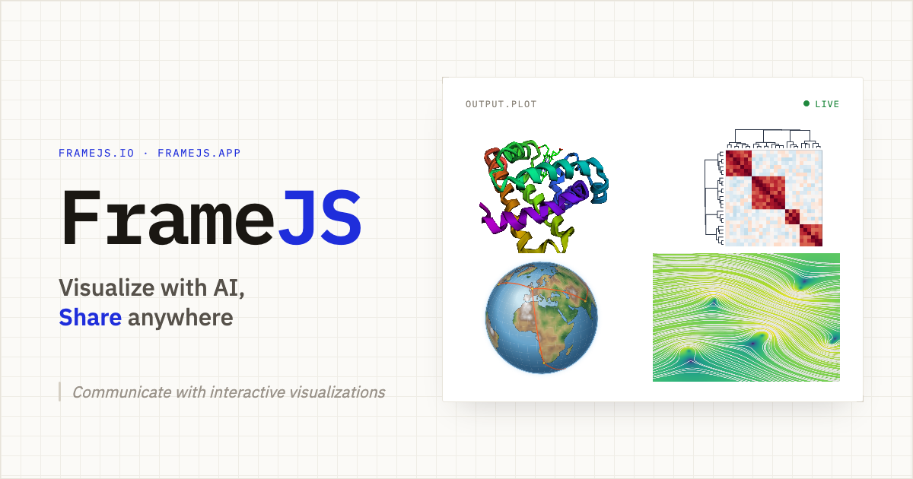

<div align="center">

<a href="https://framejs.io">
  
</a>

# framejs.io

**Interactive JavaScript that lives in a URL.** Prompt AI to build it, then embed or share it anywhere.

[**Live Docs →**](https://framejs.io/docs) · [Create now](https://framejs.io#?edit=true) · [Examples](https://framejs.io/docs/examples/) · [Developer docs](./docs/development/README.md)

</div>

---

## What is it?

[framejs.io](https://framejs.io) is an open-source, embeddable, editable web app. You write (or ask AI to write) an ES6 JavaScript module — a visualization, dashboard, widget, app, or game — and **all of the code and state is encoded in the URL**. There is no server storage and no account required: the URL *is* the program, so anyone with the link can run it instantly.

- 🤖 **Create with AI** — describe what you want in plain language; works with Claude, ChatGPT, or any LLM.
- 🔗 **Share via URL** — copy the link and it just runs. Content-addressed short URLs too.
- 🧩 **Embed anywhere** — Notion, Obsidian, Confluence, Google Docs, Jupyter, or your own site.
- 📓 **Notebook widgets** — use any frame as an interactive Jupyter or marimo widget.
- 🕸️ **Connect frames** — wire inputs and outputs together to build pipelines and dashboards.
- 🖼️ **Rich previews** — links render with an Open Graph title, description, and image in Slack, Discord, and social media.

## Fastest start (AI)

framejs.io ships a portable [Agent Skill](https://agentskills.io) that works across ~40 AI coding agents (Claude Code, Gemini CLI, Cursor, Codex, and more).

**1. Install the skill** (defaults to `~/.claude/skills`; pass another harness's skills dir as an argument):

```bash
curl -fsSL https://framejs.io/skill/install.sh | sh
```

**2. Ask your AI agent** for anything visual:

```
create an interactive 3D globe that highlights countries on hover with population and fertility
```

**3.** The agent generates the JavaScript, creates a shareable short URL, and opens it in your browser. Paste an existing `framejs.io/j/<hash>` short URL to modify it.

→ Full setup and per-harness install: **https://framejs.io/docs/guide/ai**

## Fastest start (browser)

Open the editor and start typing — [**framejs.io#?edit=true**](https://framejs.io#?edit=true). Code is an ES6 module with top-level `await`; import any npm package from a CDN, add CSS, and the URL updates live as you type.

```javascript
// Send data to connected frames
setOutput("result", { temperature: 72, unit: "F" });

// Receive data from connected frames
export function onInputs(inputs) {
  const data = inputs["sensorData"];
  // process and visualize
}
```

→ Full [JavaScript API](https://framejs.io/docs/guide/javascript-api).

## Documentation

The complete, published documentation lives at **[framejs.io/docs](https://framejs.io/docs)**:

- [Quickstart](https://framejs.io/docs/quickstart)
- [Guide](https://framejs.io/docs/guide/intro) — JavaScript API, URL state, short URLs, embedding
- [AI setup](https://framejs.io/docs/guide/ai)
- [Examples](https://framejs.io/docs/examples/)
- [Integrations](https://framejs.io/docs/integrations/jupyter) — Jupyter, JupyterLite, marimo

## Developing framejs.io

Contributor documentation lives in **[`./docs/development`](./docs/development/README.md)**:

- [Local Setup](./docs/development/local-setup.md) — prerequisites and running the dev stack
- [Architecture](./docs/development/architecture.md) — how it works and project structure
- [Editor](./docs/development/editor.md) — the React/Vite frontend
- [Worker](./docs/development/worker.md) — the Deno/Hono backend
- [Deployment](./docs/development/deployment.md) — publishing the site and Python package

```bash
just dev      # start the full dev stack (worker + editor + traefik)
just check    # type-check editor + worker
just test     # run tests
```

## License

See [LICENSE](./LICENSE).
