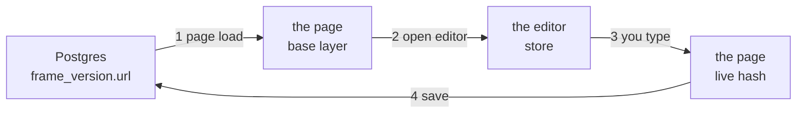
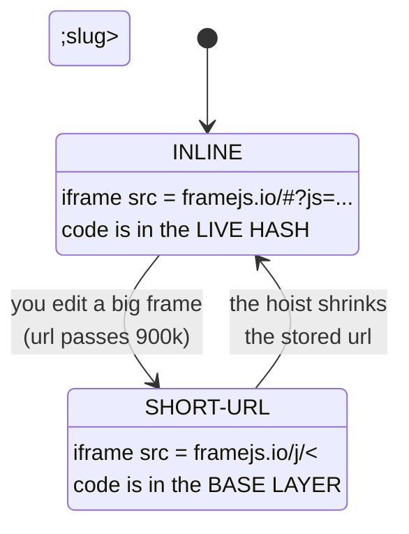

# Editing and saving

**One idea: the frame's code travels in a loop, and every bug here has been a
step in that loop dropping it.**



Four steps. Each one has to carry the **whole** code. That is the entire
contract — and the whole history of this file is steps that didn't.

| Step | How the code travels | What dropped it |
|---|---|---|
| 1 page load | server injects it into the page | dereferencing a hoisted frame made this 1.13 MB, so it was fetched instead |
| 2 open editor | **postMessage** | it used to go in the editor's url: 3.9 MB, past every browser limit, pane never loaded |
| 3 you type | **postMessage** back | the editor also navigated its parent to a url built from its own (code-free) hash |
| 4 save | the embedder reads the live hash | in short-url mode the code isn't in the live hash at all, so saves were empty |

Two of those steps are postMessage, and that is deliberate: a url cannot hold a
frame's code. Chrome drops a navigation past 2 MiB, Firefox's url parser throws
past 1 MiB, and encoding costs about 2.4×. A 1.6 MB frame is a 3.9 MB url.

---

## The one fork you have to know about

The embed has **two modes**, and it switches between them **by itself**:



Observed on a 1.6 MB frame:

| | stored url | mode | code in the live hash? |
|---|---|---|---|
| steady state | 208 chars | inline | yes, as a reference |
| right after an edit | 2,197,452 chars | **short-url** | **no** — it's in the base |

**In short-url mode the live hash has no code, and that is correct.** Anything
treating "no `js` in the live url" as "this frame has no code" deletes frames.
Two separate bugs did.

That one fork is the source of nearly all the complexity below it. See
[Making this simpler](#making-this-simpler).

---

## Rules

Each one is here because breaking it destroyed a frame or broke the editor:

1. **The code never travels in a url.** Editor transport is postMessage, both
   ways.
2. **"No code in the live hash" is normal** in short-url mode.
3. **The embedder reads an overlay, not the content.** It sees only the live
   hash, so in short-url mode it must merge onto what's stored — `liveFrameUrl`.
4. **Never save a frame that had code and now has none.** Two guards: the
   runtime refuses an empty edit, the embedder refuses a code-free url.
5. **The editor doesn't mount until it has the code.** "Not yet" (`undefined`)
   and "empty frame" (`""`) are different things. Monaco autosends, so mounting
   it empty emits an empty edit.
6. **The editor never navigates its parent.** The page owns its own url.
7. **An echo is not an edit.** The editor sends back what it was given; compare
   before saving.
8. **Chrome flags survive the mode switch** — they're added after the
   inline-or-fallback decision, not before.

---

## Making this simpler

The four-step loop is irreducible. The **two modes** are not — and they cause
rules 2, 3 and 8 outright, plus the split paths for opening the editor.

**Use short-url mode always.** Then: no length threshold, no fallback, no flags
to lose, one consistent place for the code, and the embedder has one rule
instead of two. Rules 2, 3 and 8 become unnecessary.

What stands in the way: `/j/<slug>` resolves params through an endpoint that
serves **public frames only**, so a private frame can't use it. Fixing that
needs an authenticated params fetch — a short-lived signed token framejs.app
issues and `/j/<uuid>/params` accepts. That is a bounded piece of work, and it
would delete more of this document than anything else could.

Smaller wins available now:

- **Hoist sooner.** The 1 MiB threshold is why an edit flips the mode at all. A
  lower one keeps frames in the reference form almost always.
- **Hoist more than `js`.** `inputs`, `modules` and `definition` are never
  hoisted, so a data-heavy frame has no backstop but the 900k fallback.

---

## How to observe it

Reasoning about this path produced four wrong fixes in a row. What worked:

```bash
# a stub framejs.app serving a ~1.6 MB frame as a hoisted reference, on :8799
# the real framejs.io worker against it, plain HTTP so a browser can reach it
cd framejs.io/editor && just build && cp -R dist ../client/dist
cd ../worker && FRAMEJS_APP_ORIGIN=http://localhost:8799 PORT=8798 \
  deno run -A server.ts

# Playwright, run from framejs.io/test so it resolves @playwright/test, driving
# a SAME-ORIGIN harness page so the iframe's internals are readable
```

Then print this row after every step — open, close, open, close:

```
__SHORT_URL_ID · js in location.hash · js in __SHORT_URL_HASH_PARAMS
#iframe-container · whether the frame rendered
```

The mode flipping, and the parent being navigated away, were both invisible in
the source and obvious in that row. `just check` and the unit suites cannot see
any of it.
