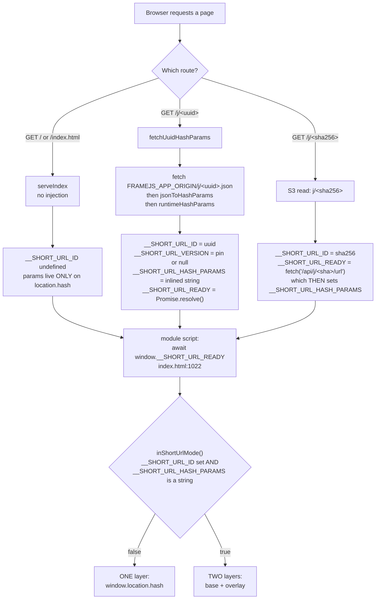
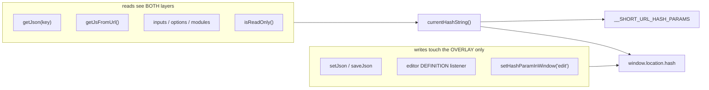
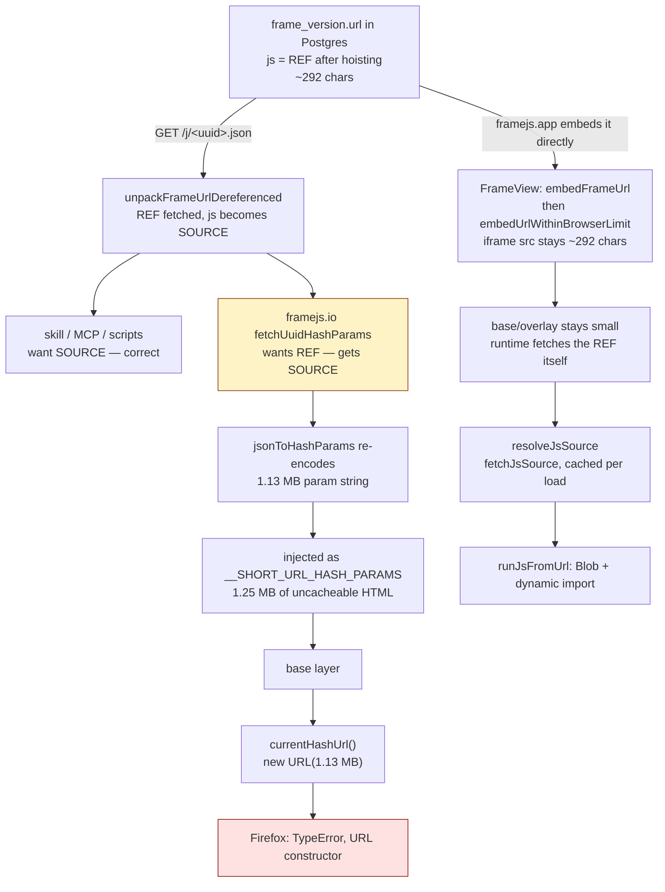
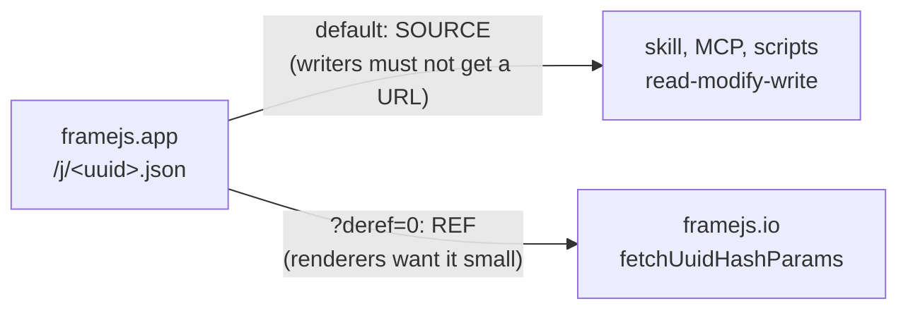
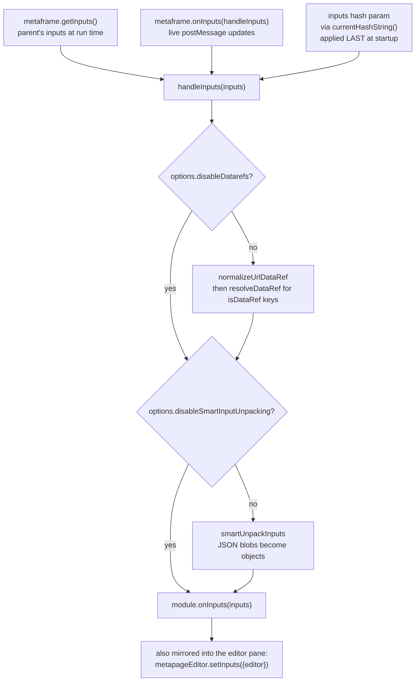
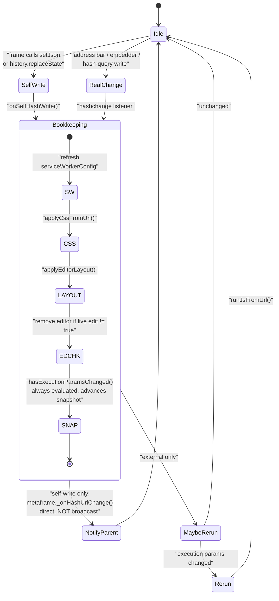
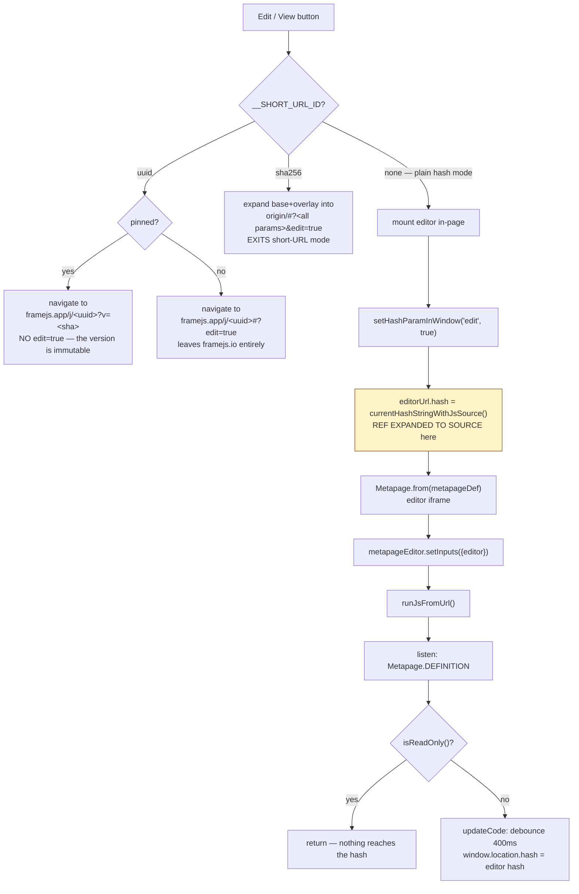
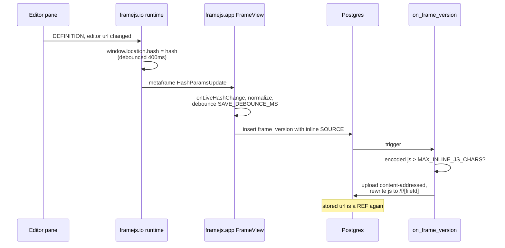

# Runtime load & state machine

How `worker/index.html` gets its hash params, how `js` and `inputs` reach the
frame, who consumes which representation, and what the edit cycle does to all of
it.

The user-facing contract for URL state is `docs/guide/url-state.md`
(https://framejs.io/docs/guide/url-state). This page is the implementation
behind it.

Written because the machine is implicit: it is spread across `worker/server.ts`,
a 3000-line inline module in `worker/index.html`, the editor's
`useShortUrlMode`, and framejs.app's `FrameView` + `/j/<uuid>.json`. Nothing
names the states, so every change has to re-derive them.

**The one thing to take away:** `js` has **two legal representations** — inline
source, and a single-line http(s) URL referencing source — and the codebase has
no name for that distinction. Most confusion here is really that one unnamed
fork. See [The `js` representation pipeline](#the-js-representation-pipeline).

---

## 1. Serving modes — where params come from

Three ways the page is served, and they differ only in what the server injects
into the HTML. Everything downstream reads those globals.



Two asymmetries worth knowing:

- **uuid is synchronous, sha256 is asynchronous.** The uuid page inlines the
  params into the HTML. The sha256 page deliberately does not — crawlers get OG
  tags without paying for the payload — so it ships a `fetch` promise instead.
  `await __SHORT_URL_READY` is what makes both safe to read from.
- **`runtimeHashParams` only runs on the uuid path.** It strips `edit` and
  `readonly` from the stored params, then re-adds `readonly=true` when the
  request is pinned (`?v=<sha256>`). So a pin's read-only-ness is decided by the
  server, never by the stored version.

---

## 2. The two layers

In short-URL mode `currentHashString()` (index.html:1162) merges a server-supplied
**base** with a live **overlay**:

| | Source | Written by | Lifetime |
|---|---|---|---|
| **Base** | `window.__SHORT_URL_HASH_PARAMS` | the server, once | the page load |
| **Overlay** | `window.location.hash` | `setJson`, the editor, the address bar, an embedder | mutable |

Overlay keys win per-key. `NON_OVERRIDABLE_PARAMS = {edit}` is the sole
exception — `edit` is a one-shot hand-off flag, so `#?edit=true` on a short URL
must not drop the page into edit mode by itself.

Outside short-URL mode there is no base: `currentHashString()` returns
`window.location.hash` verbatim.

**Why this matters for URL length.** `setJson` reads and writes
`window.location.hash` — the *overlay only* (index.html:1286). So on a `/j/<uuid>`
page a frame that saves 200 bytes of state produces a 200-byte URL; the megabyte
of `js` sits in the base and is never serialized into a URL. In plain hash mode
there is no base, so the same `setJson` rewrites the entire multi-megabyte hash on
every call.



### `currentHashUrl()` — the known hazard

`currentHashUrl()` (index.html:1176) concatenates origin + pathname + search +
`currentHashString()` into a URL **containing every param**, so that two readers
can use hash-query's `*FromUrl` helpers:

- `getJsFromUrl()` — index.html:2122, reads `js`
- `applyCssFromUrl()` — index.html:2242, reads `css`

Those helpers call `new URL()`. Firefox's URL parser hard-caps at 1 MiB
(`network.standard-url.max-length`) and **throws** past it; Chrome and Safari
parse on. So reading one param crashes on an oversize *neighbouring* param, in
one browser only. A frame with a megabyte of `js` dies in `applyCssFromUrl`
while reading a `css` param it does not even have.

It exists only because hash-query had no `*FromHashString` variant for base64
values. Once it does, both call sites read `currentHashString()` directly and
this helper should be deleted, not repaired.

---

## 3. The `js` representation pipeline

`js` is either **inline source** or a **reference** — a single-line http(s) URL
(`isJsSourceUrl`, index.html:2161). The same test governs `css`.

The reference exists because of a size cliff: framejs.app's `on_frame_version`
trigger hoists any stored `js` whose *encoded* value passes
`MAX_INLINE_JS_CHARS` (1 MiB) into content-addressed storage and rewrites the
param to `https://framejs.app/f/<fileId>`.



Read the right-hand path and the left-hand path together: **the same stored
frame is 292 chars when framejs.app embeds it and 1.13 MB when framejs.io serves
it.** The hoist is undone by exactly one edge — `fetchUuidHashParams` consuming
an endpoint that promises source.

Counting representation changes on that path, for a string that was already
correct at step 1:

1. stored hash-param string (REF)
2. `unpackFrameUrl` → dict
3. `unpackFrameUrlDereferenced` → dict with SOURCE
4. JSON over the wire
5. `jsonToHashParams` → hash-param string again
6. `runtimeHashParams` → strip/add chrome flags

### Where `?deref=0` / `wantsRawJsReference` would sit

One edge. Not a new state:



The flag reads as complexity because `js`'s two forms are unnamed, so a
parameter selecting between them looks like a new mode. It is not: both forms
already exist, both already cross this boundary, and the runtime already handles
both (`resolveJsSource`).

**A simpler alternative, if the flag still grates.** framejs.io does not want
the JSON dict at all — it decodes it only to re-encode it at step 5. A separate
endpoint returning the **raw stored hash-param string** would delete the flag,
the dereference decision, *and* steps 2–5:

```
GET /j/<uuid>/params  ->  "?js=<base64 of REF>&og=<base64>"
```

Then `fetchUuidHashParams` is a passthrough, `/j/<uuid>.json` keeps its single
honest contract ("`js` means source"), and no caller has to know that `js` has
two forms. Worth considering before adding the flag.

---

## 4. `inputs` — three sources, one funnel

Unlike `js`, inputs arrive from the parent over postMessage *and* from the hash.
Both land in `handleInputs`, built inside `runJsFromUrl` (index.html:2711).



Note that inputs are **never hoisted**. The `on_frame_version` trigger only
hoists `js`, so a frame whose bulk is `inputs` has no size backstop except
framejs.app's `embedUrlWithinBrowserLimit` fallback.

---

## 5. Hash writes — self-write vs external change

A frame saving its own state must be announced upward (so framejs.app saves a
version) but must *not* re-run the frame or reach the frame's own `hashchange`
listeners. `history.replaceState` fires no `hashchange`, so the runtime patches
it (`announceSelfHashWrites`, index.html:1096).



`NON_EXECUTION_PARAMS = {og, css, editorWidth, edit, hm, readonly}` — changing
any of these never re-runs the user's JS. The snapshot is **sorted**, because a
hash-query write rewrites the whole hash without preserving order, and
reordering the same params is not a content change.

---

## 6. The edit cycle

`onMenuClick` (index.html:3044) branches three ways on serving mode, and only
the third mounts an editor in-page.



Two things in that flow deserve attention.

**`currentHashStringWithJsSource()` is a second oversize-URL site.** It expands
the `js` reference back into source and assigns it to `editorUrl.hash`, whose
`.href` becomes the editor iframe's `src`. For a megabyte frame that is another
`new URL()` over >1 MiB, independent of `currentHashUrl()`. Fixing
`applyCssFromUrl` does not fix this path.

**The editor's write is what re-inlines source into the frame's own URL.** The
pane emits its hash, `updateCode` assigns it to `window.location.hash`, and that
is the *overlay* — so an edit overrides the base's `js` with inline source. Which
is correct: it is a new version, and framejs.app re-hoists it.

### The full write-back loop



The loop is asynchronous and best-effort, so there is a real window after each
save in which the stored `js` is still inline source.

---

## 7. Who consumes which representation

| Consumer | Reads via | `js` form it sees | Correct? |
|---|---|---|---|
| `runJsFromUrl` (executes the frame) | `getJsFromUrl` + `resolveJsSource` | SOURCE — fetches a REF | yes |
| `applyCssFromUrl` | `currentHashUrl()` | n/a, reads `css` | **builds a URL over all params — crash site** |
| Editor pane | `currentHashStringWithJsSource()` | SOURCE — REF expanded | yes, but see §6 |
| `getJson` / frame state | `currentHashString()` | n/a | yes |
| Parent embedder (framejs.app) | metaframe `HashParamsUpdate` off `window.location.hash` | REF normally; SOURCE after an editor write | yes |
| `GET /j/<uuid>.json` — skill, MCP, scripts | stored version url | SOURCE, dereferenced | yes — a writer must never get a URL |
| framejs.io `/j/<uuid>` server | the same JSON endpoint | SOURCE | **no — wants the REF** |
| `frame_version.url` in Postgres | — | REF once hoisted | yes |

---

## Invariants

Worth not breaking:

1. **A reference is never written onto `window.location.hash`.** The embedder
   watches that URL to decide when to save, and a `setJson` frame rewrites it on
   every interaction — expanding there would hand framejs.app the whole source
   each time and undo the hoist.
2. **`setJson` writes the overlay only.** This is what bounds URL growth in
   short-URL mode.
3. **A dereference failure is never reported as empty code.** `js: ""` is
   indistinguishable from a frame with no code, and the documented way to edit a
   frame is read-modify-write — so an empty answer gets saved as a version with
   no code, erasing the frame on a transient network error. `/j/<uuid>.json`
   answers 502; `resolveJsSource` writes to the frame's own stderr.
4. **`edit` never survives into stored params.** `runtimeHashParams` strips it
   server-side; `NON_OVERRIDABLE_PARAMS` keeps a link's copy from taking effect.
5. **Nothing hand-rolls hash parsing.** Reads and writes go through
   `@metapages/hash-query`. `parseHashPairs` is the one exception, and only
   because the overlay merge needs raw ordered pairs.

## Known sharp edges

- `currentHashUrl()` — §2. Firefox-only crash, two call sites.
- `currentHashStringWithJsSource()` — §6. Second oversize-URL site, editor path.
- Only `js` is hoisted. `inputs`, `modules`, `definition` and `setJson` state
  have no size backstop but `embedUrlWithinBrowserLimit`.
- `embedUrlWithinBrowserLimit` falls back to `/j/<slug>`, which needs a **public**
  frame — a private oversize frame has no working fallback.
- The hoist is async and post-save, so a freshly saved large frame is inline
  source for a while.
- framejs.app's `Gallery` embeds `embedFrameUrl` with no length guard.
