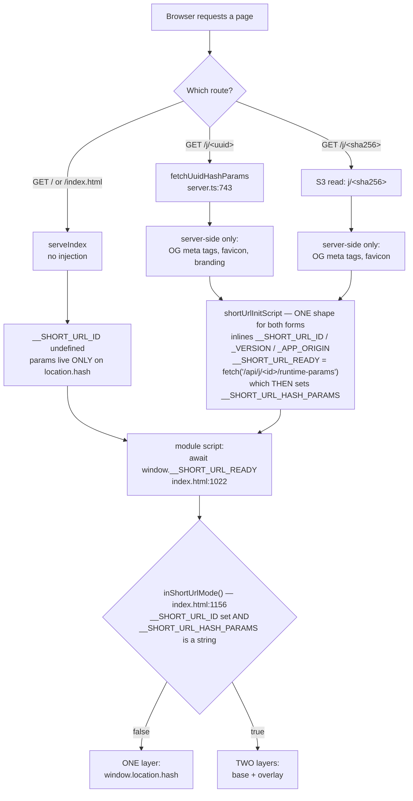
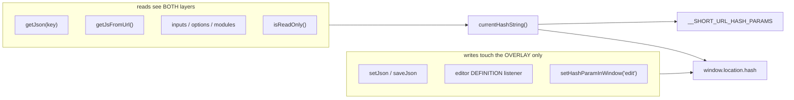
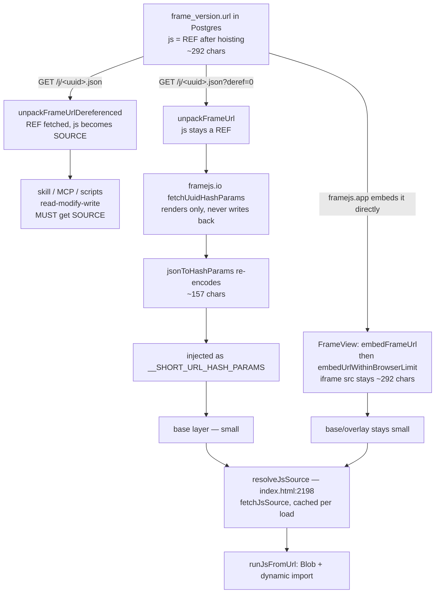
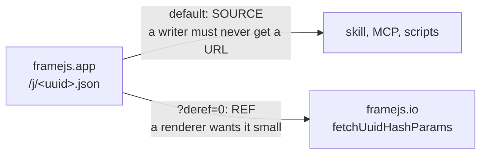
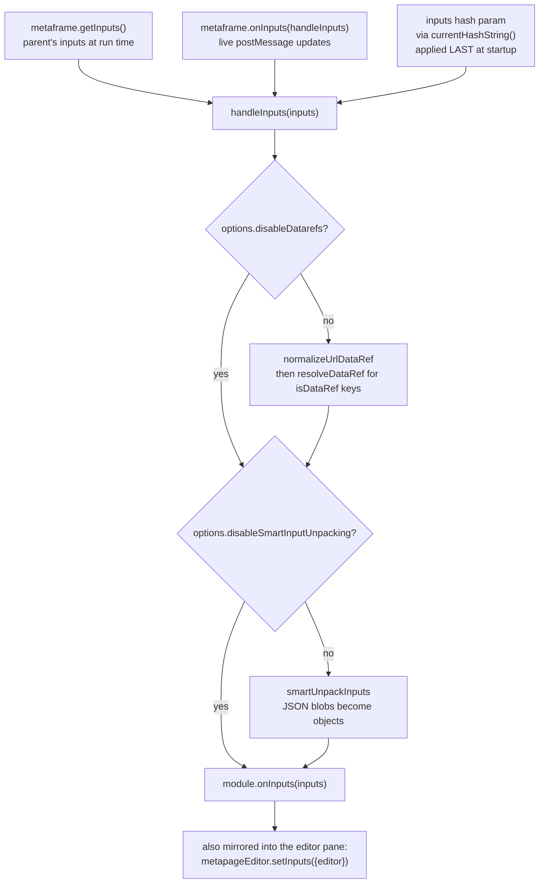
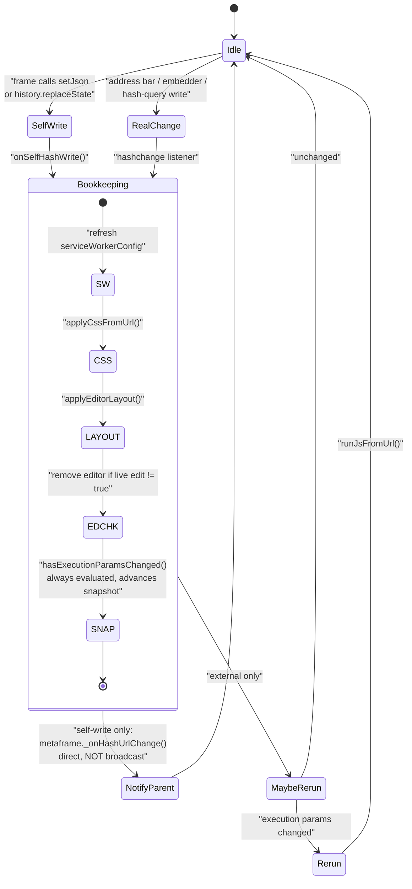
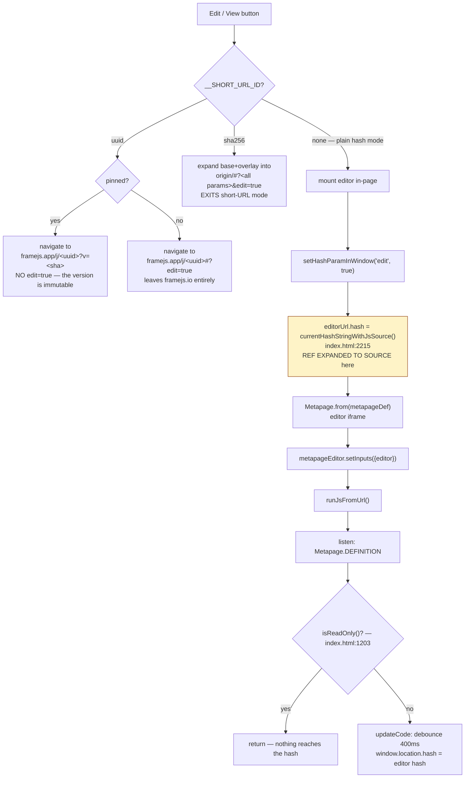
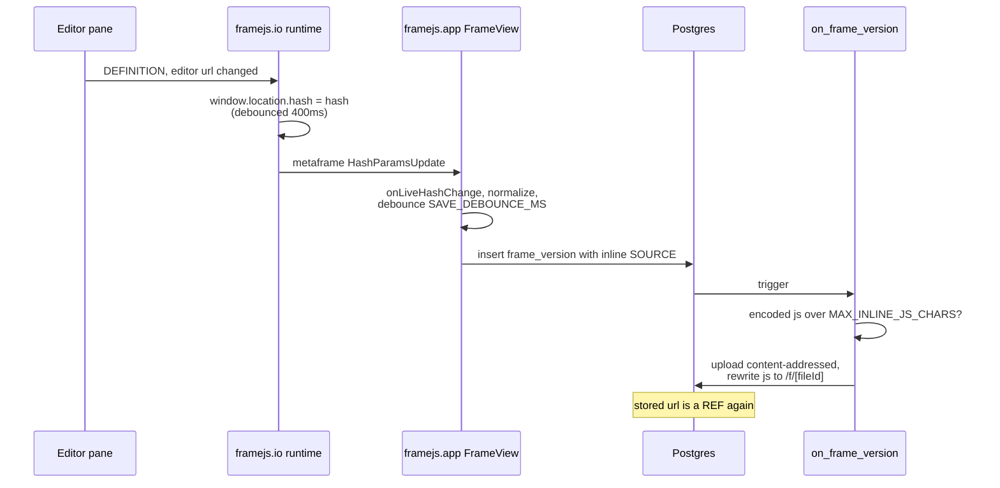

# Runtime load & state machine

How `worker/index.html` gets its hash params, how `js` and `inputs` reach the
frame, who consumes which representation, and what the edit cycle does to all of
it.

The user-facing contract for URL state is `docs/guide/url-state.md`
(https://framejs.io/docs/guide/url-state). This page is the implementation
behind it.

Written because the machine is implicit: it is spread across `worker/server.ts`,
a 3000-line inline module in `worker/index.html`, the editor's
`useShortUrlMode`, and framejs.app's `FrameView` + `/j/<uuid>.json`. Nothing
names the states, so every change has to re-derive them.

**The one thing to take away:** `js` has **two legal representations** — inline
source, and a single-line http(s) URL referencing source — and the codebase has
no name for that distinction. Most confusion here is really that one unnamed
fork. See [The `js` representation pipeline](#3-the-js-representation-pipeline).

---

## 1. Serving modes — where params come from

Three ways the page is served, and they differ only in what the server injects
into the HTML. Everything downstream reads those globals.



**The params are always fetched, never inlined** (`shortUrlInitScript` in
`src/short-url-init.ts`). `/j/:uuid` used to inline them, which put a large
frame's whole payload inside a `Cache-Control: no-cache` document — re-sent on
every load and every crawler/unfurl of the link. The sha256 page had fetched
from the start for exactly that reason; the two were unified.

The latency cost is close to nothing: the init script is a *classic* script, so
it runs during parse and its fetch overlaps the two cross-origin jsdelivr module
imports (hash-query, metapage) that the deferred runtime module already blocks
on. Measured on a frame whose stored `js` is a hoisted reference: the page went
from ~1.25 MB to **119,572 bytes** (i.e. the runtime shell and nothing else),
with a 136-byte params response beside it.

Everything else stays inlined — a few bytes each, and the edit hand-off
(`onMenuClick`) reads them synchronously.

Two things to know:

- **`__SHORT_URL_READY` must never reject.** index.html awaits it unguarded
  (index.html:1022), so a rejection aborts the whole runtime module and the page
  renders *nothing* — worse than a frame that fails to load. The init script's
  `.catch` resolves with `""` instead, and a non-2xx response is treated as a
  failure rather than being handed to the runtime as params.
- **`runtimeHashParams` now runs in the params endpoint,** not the page handler.
  It strips `edit` and `readonly` from the stored params and re-adds
  `readonly=true` when the request is pinned (`?v=<sha256>`), so a pin's
  read-only-ness is decided by the server, never by the stored version. This
  applies to **both** forms now; previously the sha256 page skipped it, so a
  stored `edit=true` would drag that page straight back out of short-URL mode.

### `/api/j/:id/runtime-params` caching

Getting the params out of the (always `no-cache`) HTML is what makes them
cacheable at all, and the right policy depends on what the id names:

| id | Policy | Why |
|---|---|---|
| sha256 | `public, max-age=31536000, immutable` | content-addressed — the params for that id can never change |
| uuid + `?v=<sha256>` | `public, max-age=31536000, immutable` | a published version is permanent |
| uuid, live | `ETag` + `Cache-Control: no-cache` | mutable, so revalidate; an unchanged repeat load is a 304, not the payload |

`no-cache` means "revalidate before use", not "do not store" — which is exactly
what lets the live case answer 304.

### The page never resolves frame content

A page request needs only og metadata — the `<meta>` tags and whether there is
an og image. It used to get that by resolving the whole frame, while the browser
separately resolved the same frame for the runtime: **two full content
resolutions per page load** to produce ~200 bytes of markup. Both forms now read
an og-only source instead:

| | og source | Cost |
|---|---|---|
| sha256 | `og/<sha256>` sidecar in S3 | 63 bytes vs a 533,508-byte blob (measured) |
| uuid | `GET /j/<uuid>/og.json` on framejs.app, straight off the `frame_versions.og` jsonb column | no url decode, no `js` dereference |

The sha256 sidecar is written on both shorten paths next to the existing
`favicon/<sha256>` derivation, and written even for an og-less frame (as
`{"og":null}`) so its presence can stand in for "this frame exists" — which is
what lets the page skip a separate existence check. A miss falls back to the
blob and backfills, so a frame shortened before sidecars shipped pays the full
read exactly once. On the uuid side the column already exists and is kept in
sync with the url's `og` param by the `on_frame_version` trigger, so there is
nothing to store.

Both og sources apply the same privacy gate as the params endpoint — a pin
resolves even for a now-private frame, otherwise the frame must be live and
public — because the page relies on a 404 to decide not to serve a shell.

Verified end-to-end: one full-content call per page load, down from two.

---

## 2. The two layers

In short-URL mode `currentHashString()` (index.html:1162) merges a
server-supplied **base** with a live **overlay**:

| | Source | Written by | Lifetime |
|---|---|---|---|
| **Base** | `window.__SHORT_URL_HASH_PARAMS` | the server, once | the page load |
| **Overlay** | `window.location.hash` | `setJson`, the editor, the address bar, an embedder | mutable |

Overlay keys win per-key. `NON_OVERRIDABLE_PARAMS = {edit}` is the sole
exception — `edit` is a one-shot hand-off flag, so `#?edit=true` on a short URL
must not drop the page into edit mode by itself.

Outside short-URL mode there is no base: `currentHashString()` returns
`window.location.hash` verbatim.

**Why this matters for URL length.** `setJson` reads and writes
`window.location.hash` — the *overlay only* (index.html:1295). So on a
`/j/<uuid>` page a frame that saves 200 bytes of state produces a 200-byte URL;
the megabyte of `js` sits in the base and is never serialized into a URL. In
plain hash mode there is no base, so the same `setJson` rewrites the entire
multi-megabyte hash on every call.



### Never build a URL out of the params

Every read goes through `currentHashString()` and a hash-query
`*FromHashString` getter. **Do not reintroduce a helper that concatenates the
params into a URL** in order to use a `*FromUrl` getter.

There used to be one — `currentHashUrl()` — because hash-query had no
`*FromHashString` variant for base64 values. It produced a URL containing
*every* param so that two readers could get at one:

- `getJsFromUrl()` — index.html:2131, reads `js`
- `applyCssFromUrl()` — index.html:2254, reads `css`

Those getters call `new URL()`. Firefox's URL parser hard-caps at 1 MiB
(`network.standard-url.max-length`) and **throws** past it; Chrome and Safari
parse on. So reading one param crashed on an oversize *neighbouring* param, in
one browser only — a frame with a megabyte of `js` died in `applyCssFromUrl`
while reading a `css` param it did not even have.

Fixed in `9f787ff` by adding the missing getters to hash-query (0.11.0) and
deleting the helper. The params here have no size bound, so any future
`new URL(<all params>)` reintroduces the same crash.

---

## 3. The `js` representation pipeline

`js` is either **inline source** or a **reference** — a single-line http(s) URL
(`isJsSourceUrl`, index.html:2173). The same test governs `css`.

The reference exists because of a size cliff: framejs.app's `on_frame_version`
trigger hoists any stored `js` whose *encoded* value passes
`MAX_INLINE_JS_CHARS` (1 MiB) into content-addressed storage and rewrites the
param to `https://framejs.app/f/<fileId>`.



### What `?deref=0` is for

It is one parameter on one existing edge — not a new state:



Both forms already existed, both already crossed this boundary, and the runtime
already handled both (`resolveJsSource`). The flag reads as complexity only
because `js`'s two forms are unnamed, so a parameter selecting between them
looks like a new mode.

**What it fixed.** Before `?deref=0`, framejs.io consumed an endpoint that
promises *source*, so the hoist was undone by exactly one edge: the same stored
frame was 292 chars when framejs.app embedded it and **1.13 MB** when framejs.io
served it. Measured on `01a0edf0b07e7e109222f858ac01bba6` (474 KB of source,
2.39× encoding overhead):

| | param string | page HTML |
|---|---|---|
| before | 1,133,981 chars | ~1.25 MB, inlined, `no-cache` |
| after | ~157 chars | 119,572 bytes (shell only) + an immutable cached source file |

That 1.13 MB base layer is what `currentHashUrl()` then fed to `new URL()`.

The two fixes are independent and compound: `?deref=0` shrinks the params, and
fetching them (§1) keeps whatever size they are out of the HTML.

Counting representation changes on the old path, for a string that was already
correct at step 1:

1. stored hash-param string (REF)
2. `unpackFrameUrl` → dict
3. `unpackFrameUrlDereferenced` → dict with SOURCE
4. JSON over the wire
5. `jsonToHashParams` → hash-param string again
6. `runtimeHashParams` → strip/add chrome flags

`?deref=0` removes step 3. Steps 2, 4 and 5 remain.

**A simpler alternative, if the flag still grates.** framejs.io does not want
the JSON dict at all — it decodes it only to re-encode it at step 5. A separate
endpoint returning the **raw stored hash-param string** would delete the flag,
the dereference decision, *and* steps 2–5:

```
GET /j/<uuid>/params  ->  "?js=<base64 of REF>&og=<base64>"
```

Then `fetchUuidHashParams` is a passthrough, `/j/<uuid>.json` keeps its single
honest contract ("`js` means source"), and no caller has to know that `js` has
two forms.

---

## 4. `inputs` — three sources, one funnel

Unlike `js`, inputs arrive from the parent over postMessage *and* from the hash.
Both land in `handleInputs`, built inside `runJsFromUrl` (index.html:2726).



Note that inputs are **never hoisted**. The `on_frame_version` trigger only
hoists `js`, so a frame whose bulk is `inputs` has no size backstop except
framejs.app's `embedUrlWithinBrowserLimit` fallback.

---

## 5. Hash writes — self-write vs external change

A frame saving its own state must be announced upward (so framejs.app saves a
version) but must *not* re-run the frame or reach the frame's own `hashchange`
listeners. `history.replaceState` fires no `hashchange`, so the runtime patches
it (`announceSelfHashWrites`, index.html:1096).



`handleHashChange` is index.html:2945.
`NON_EXECUTION_PARAMS = {og, css, editorWidth, edit, hm, readonly}`
(index.html:2889) — changing any of these never re-runs the user's JS. The
snapshot is **sorted**, because a hash-query write rewrites the whole hash
without preserving order, and reordering the same params is not a content
change.

---

## 6. The edit cycle

`onMenuClick` (index.html:3059) branches three ways on serving mode, and only
the third mounts an editor in-page.



Two things in that flow deserve attention.

**`currentHashStringWithJsSource()` is a second oversize-URL site, still
unfixed.** It expands the `js` reference back into source and assigns it to
`editorUrl.hash`, whose `.href` becomes the editor iframe's `src`. For a
megabyte frame that is another `new URL()` over >1 MiB. `9f787ff` did not touch
this path — it fixed only the two `currentHashUrl()` readers — so opening the
editor on a large frame in Firefox is expected to still fail.

**The editor's write is what re-inlines source into the frame's own URL.** The
pane emits its hash, `updateCode` assigns it to `window.location.hash`, and that
is the *overlay* — so an edit overrides the base's `js` with inline source. Which
is correct: it is a new version, and framejs.app re-hoists it.

### The full write-back loop



The loop is asynchronous and best-effort, so there is a real window after each
save in which the stored `js` is still inline source.

---

## 7. Who consumes which representation

| Consumer | Reads via | `js` form it sees | Correct? |
|---|---|---|---|
| `runJsFromUrl` (executes the frame) | `getJsFromUrl` + `resolveJsSource` | SOURCE — fetches a REF | yes |
| `applyCssFromUrl` | `currentHashString()` | n/a, reads `css` | yes (since `9f787ff`) |
| Editor pane | `currentHashStringWithJsSource()` | SOURCE — REF expanded | yes, but see §6 |
| `getJson` / frame state | `currentHashString()` | n/a | yes |
| Parent embedder (framejs.app) | metaframe `HashParamsUpdate` off `window.location.hash` | REF normally; SOURCE after an editor write | yes |
| `GET /j/<uuid>.json` — skill, MCP, scripts | stored version url, dereferenced | SOURCE | yes — a writer must never get a URL |
| framejs.io `/j/<uuid>` server | the same endpoint with `?deref=0` | REF | yes (since `b90a3c7` + `9f787ff`) |
| `frame_version.url` in Postgres | — | REF once hoisted | yes |

---

## Invariants

Worth not breaking:

1. **A reference is never written onto `window.location.hash`.** The embedder
   watches that URL to decide when to save, and a `setJson` frame rewrites it on
   every interaction — expanding there would hand framejs.app the whole source
   each time and undo the hoist.
2. **`setJson` writes the overlay only.** This is what bounds URL growth in
   short-URL mode.
3. **No `new URL()` over the full param set.** See §2. Read params with
   hash-query's `*FromHashString` getters.
4. **A dereference failure is never reported as empty code.** `js: ""` is
   indistinguishable from a frame with no code, and the documented way to edit a
   frame is read-modify-write — so an empty answer gets saved as a version with
   no code, erasing the frame on a transient network error. `/j/<uuid>.json`
   answers 502; `resolveJsSource` writes to the frame's own stderr.
5. **`edit` never survives into stored params.** `runtimeHashParams` strips it
   server-side; `NON_OVERRIDABLE_PARAMS` keeps a link's copy from taking effect.
6. **Nothing hand-rolls hash parsing.** Reads and writes go through
   `@metapages/hash-query`. `parseHashPairs` is the one exception, and only
   because the overlay merge needs raw ordered pairs.
7. **`__SHORT_URL_READY` resolves, never rejects.** index.html awaits it
   unguarded, so a rejection takes the whole runtime module down and renders a
   blank page. Failures resolve with `""` (see §1).
8. **The params never ride in the HTML.** They are fetched, so the page stays
   the runtime shell regardless of frame size, and a crawler or unfurl pays only
   for the OG tags.

## Dependency state

`worker/index.html` imports `@metapages/hash-query@0.11.0` for the
`*FromHashString` getters (§2). Published and serving as of 2026-10-05
(`cdn.jsdelivr.net/npm/@metapages/hash-query@0.11.0` → 200, `x-jsd-version:
0.11.0`), so the runtime's pin resolves.

If you bump that pin again, check the jsdelivr URL resolves *before* deploying:
the import is a hard dependency of the runtime module, so a 404 there fails the
whole page in every browser, not just the one the getters were added for.

Deploy order: deploy framejs.app → deploy framejs.io. Either order is harmless
in practice — an app that ignores `?deref=0` just returns the previous
behaviour, and `/api/j/:id/runtime-params` is served by framejs.io itself.

## Known sharp edges

- `currentHashStringWithJsSource()` — §6. Second oversize-URL site, editor path,
  **not yet fixed**.
- Only `js` is hoisted. `inputs`, `modules`, `definition` and `setJson` state
  have no size backstop but `embedUrlWithinBrowserLimit`.
- `embedUrlWithinBrowserLimit` falls back to `/j/<slug>`, which needs a **public**
  frame — a private oversize frame has no working fallback.
- The hoist is async and post-save, so a freshly saved large frame is inline
  source for a while.
- framejs.app's `Gallery` embeds `embedFrameUrl` with no length guard.
