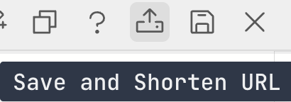
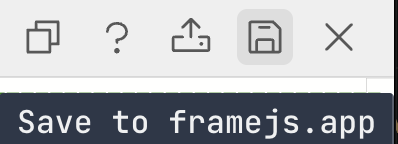

# Saving and Short URLs

Since all code and state is stored in the URL hash, metaframe URLs can get very long. The built-in URL shortener compresses these into compact, shareable links.

There are two forms of short URL persistence:
 - Expiring immutable URLs
 - Durable editable URLs

## Howto: Expiring immutable URLs

1. Click the **Create expiring snapshot** button in the editor header 
2. The current hash parameters (code, inputs, options) are stored in [R2](https://www.cloudflare.com/developer-platform/products/r2/) 
3. You get a short URL `framejs.io/j/<SHA256-based short ID>`
4. Title, description, and image are supported for nice bookmarks and previews

The short URL is automatically copied to your clipboard.

The content is immutable — the same content always produces the same short URL.
Short URLs are a **free convenience snapshot, kept for a month** and then garbage-collected. They are perfect for quick sharing, previews, and QR codes. If you need a link that lasts, save the content to a durable **Frame** on [framejs.app](https://framejs.app) — see below and 
[Persistence & Data Retention](/guide/persistence) for the full retention model
across every kind of URL.

## Howto: Durable editable URLs

1. Click the **Save to framejs.app** button in the editor header 
2. The current hash parameters (code, inputs, options) are persisted
3. The durable editable short URL `framejs.app/j/<uuid>` opens
4. You can claim this URL for your account if authenticated


## Longer discussion between the two short-URL forms: `/j/<sha256>` vs `/j/<uuid>`

Both forms look alike — `framejs.io/j/…` and `framejs.app/j/…` — but they make
**very different persistence promises**. The **Create expiring snapshot** button
above creates the ephemeral `sha256` form; saving into an account creates the
durable `uuid` form.

| | `framejs.io/j/<sha256>` | `framejs.app/j/<uuid>` |
|--|--------------------------|-------------------------|
| **Identifier** | SHA-256 of the content (content-addressed) | Random UUID (a stable document handle) |
| **Backed by** | Immutable blob in object storage (R2) | Versioned rows in a database, tied to an account |
| **Mutable?** | No — different content always yields a different URL | Yes — the same URL, edited over time (append-only version history) |
| **Account?** | None required | Owned by an account (free tier included) |
| **Persistence** | Free, best-effort, kept **~30 days**, then garbage-collected | **Durable & guaranteed** while the account is active |
| **Best for** | Quick sharing, previews, QR codes, paste-into-chat | Anything you need to keep, keep editing, or make private |

In short: **`sha256` is a disposable snapshot; `uuid` is a durable document.**
You get the best of both by **publishing** an exact immutable version of a
durable Frame (Frame menu → **Publish version**), which mints
`framejs.app/j/<uuid>?v=<sha256>` — a stable handle *and* an unchanging snapshot.
A published version is **permanently public and citable, like a DOI**: it keeps
resolving even if you later make the Frame private or delete it, and both apps
serve it (`framejs.io/j/<uuid>?v=<sha256>` renders the same snapshot on the
runtime). See [Persistence & Data Retention](/guide/persistence) for the
complete model.

## Example

A full URL like this:

```
https://framejs.io/#?js=Y29uc3QgZGl2ID0gZG9jdW1lbnQuY3Jl...&options=eyJhdXRvcnVuIjp0cnVlfQ%3D%3D
```

Becomes:

```
https://framejs.io/j/8a3b1c9f4e2d7a6b5c8d9e0f1a2b3c4d5e6f7a8b9c0d1e2f3a4b5c6d7e8f9a0b
```

When someone opens the short URL, the page loads with all the original code and state intact — no redirect, the browser stays on the `/j/...` path.

## API

You can also shorten URLs programmatically.

### `POST /api/shorten` — Shorten from hash params

Store raw hash params and get a short URL ID back.

```bash
curl -X POST https://framejs.io/api/shorten \
  -H "Content-Type: application/json" \
  -d '{"hashParams": "?js=Y29uc29sZS5sb2coImhlbGxvIik%3D"}'
```

Response:

```json
{
  "success": true,
  "id": "8a3b1c9f...",
  "path": "/j/8a3b1c9f..."
}
```

### `POST /api/shorten/json` — Shorten from JSON

A convenience endpoint that encodes JavaScript and options into hash params for you.

```bash
curl -X POST https://framejs.io/api/shorten/json \
  -H "Content-Type: application/json" \
  -d '{"js": "console.log(\"hello\")"}'
```

Response:

```json
{
  "id": "8a3b1c9f...",
  "shortUrl": "https://framejs.io/j/8a3b1c9f...",
  "fullUrl": "https://framejs.io/#?js=Y29uc29sZS5sb2coImhlbGxvIik%3D",
  "hashParams": "?js=Y29uc29sZS5sb2coImhlbGxvIik%3D"
}
```

### `GET /api/j/:sha256` — Retrieve decoded hash params

Returns the short URL ID and decoded hash parameters as a JSON object.

```bash
curl https://framejs.io/api/j/8a3b1c9f...
```

Response:

```json
{
  "id": "8a3b1c9f...",
  "hashParams": {
    "js": "console.log(\"hello\")"
  }
}
```

### `GET /api/j/:sha256/url` — Retrieve full URL

Returns the full URL (with hash params) as plain text.

```bash
curl https://framejs.io/api/j/8a3b1c9f.../url
```

Response:

```
https://framejs.io/#?js=Y29uc29sZS5sb2coImhlbGxvIik%3D
```

### `GET /j/:sha256/qrcode.png` — QR code image

Returns a PNG QR code that encodes the short URL `https://framejs.io/j/<sha256>`. The response has CORS open (`Access-Control-Allow-Origin: *`) and is cached immutably, so the image can be embedded directly anywhere — `` tags, Markdown, slides, printed material:

```html

```

Any extra query parameters on the request are appended to the encoded URL. This lets you generate QR codes that open the short URL with additional hash/query state, for example to point at a specific tab or view:

```
https://framejs.io/j/8a3b1c9f.../qrcode.png?foo=bar
```

encodes `https://framejs.io/j/8a3b1c9f...?foo=bar`.

The encoded URL always uses the canonical `framejs.io` origin, regardless of which host served the image — so QR codes stay valid even when generated from an alias or preview domain.

### `POST /api/upload/presign` — Get presigned upload URL

Generate a presigned S3 URL for direct browser-to-storage file upload. Files are content-addressed by SHA256.

```bash
curl -X POST https://framejs.io/api/upload/presign \
  -H "Content-Type: application/json" \
  -d '{"contentType": "image/png", "sha256": "abcd1234..."}'
```

Response:

```json
{
  "presignedUrl": "https://s3.../f/abcd1234...?X-Amz-Signature=...",
  "id": "abcd1234...",
  "canonicalPath": "/f/abcd1234..."
}
```

### `GET /f/:id` — Download a file

Redirects to the public storage URL for a previously uploaded file.

```bash
curl -L https://framejs.io/f/abcd1234...
```

::: tip
Short URLs are content-addressed — the same code always produces the same short
URL. They are free and kept for about a month; for a link that lasts, save it to
a durable [Frame](/guide/persistence).
:::
