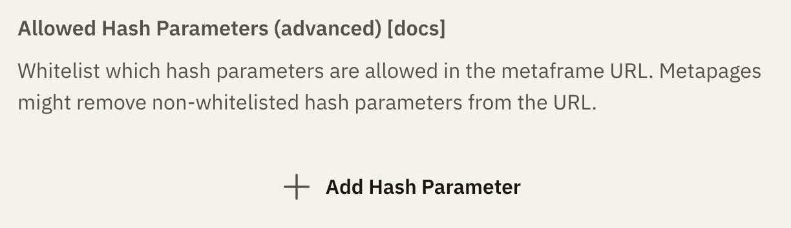

# URL State

An app can persist its own state — zoom, selection, a checklist, form values —
in the URL, so the link the user copies carries that state with it.

Two globals are all you need. They are part of the core API: always available,
nothing to import.

```javascript
// Read whatever was saved under "state" (undefined if nothing was)
const state = getJson("state") || { zoom: 1 };

// Save it back — the link now carries it
setJson("state", { ...state, zoom: 2 });

// Remove it
setJson("state", undefined);
```

`getJson(key)` returns the JSON value stored under `key`, or `undefined`.
`setJson(key, value)` stores any JSON-serializable value under `key`; passing
`undefined` (or `null`) removes it.

That is the whole API. `setJson` also registers the key in the frame's
[metaframe definition](#what-setjson-does-for-you) for you, which is what keeps
the value alive when the app is saved, shortened, or copied as a link.

::: tip `saveJson` is the same function
`saveJson(key, value)` is an alias of `setJson(key, value)` — frames written
against the older name keep working. Prefer `setJson` in new code.
:::

::: tip
This is designed for relatively small values. Large multi-megabyte JSON blobs
are not yet supported.
:::

::: warning Never write the hash yourself
No regex or `split` on `location.hash`, no
`new URLSearchParams(location.hash.slice(1))`, no hand-built `#?key=value`
strings. Values are base64-encoded over a URI-encoded payload and the param
order is canonical; the runtime, editor, shortener and frame API all agree on
that encoding, and a hand-rolled version corrupts values or breaks saving. Use
`getJson` / `setJson`.
:::

## Writing state does not re-run your app

A frame's own source lives in the URL hash, so the runtime re-executes the app
whenever the hash changes. It makes one exception: **changes the app itself
writes.** The app already holds the value it just wrote, and re-running would
throw away the DOM and every bit of in-memory state — so a slider bound to
`setJson` can write on every input event without reloading itself.

Those writes are still announced, so an app opened from
[framejs.app](https://framejs.app) saves them as a new version.

A change from **outside** the frame — editing the address bar, an embedder
rewriting the url — still re-runs the app, so it picks up the new state on the
next run. To handle those in place instead, listen for `hashchange`:

```javascript
window.addEventListener("hashchange", () => {
  const next = getJson("state") || {};
  // reconcile against what is already applied, then update the UI
});
```

::: tip
That listener also fires for your own writes. Compare against the state you last
applied and ignore anything already reflected in the UI, so a write can't cause
a render loop.
:::

## What `setJson` does for you

framejs keeps a **whitelist** of hash params, and anything outside it is removed
whenever the app is **saved, shortened, or copied as a link** — otherwise the
state would silently disappear from the URL you share.

These built-ins are always allowed, and are reserved — `setJson` throws if you
use one as a key: `js`, `inputs`, `modules`, `og`, `options`, `bgColor`, `edit`,
`editorWidth`, `hm`, `definition`, `css`.

Every other param name is whitelisted by declaring it in the frame's
**metaframe definition**, under `definition.hashParams`. The first time you call
`setJson("state", …)`, it adds

```json
{ "hashParams": { "state": { "type": "json" } } }
```

to that definition (creating the definition if the frame has none), in the same
write that stores the value. You do not have to do anything.

### Seeing it in the editor

Open **Settings** (the ⚙ icon) → the **Runtime** tab → **Allowed Hash
Parameters**, and the key your app saved is listed there. You can also add keys
by hand with **Add Hash Parameter** — useful for a param an embedder passes in
rather than one the app writes.



### Declaring a param from the API

`definition` is a normal hash param, so it can also be sent in the frame body
alongside `js` (see [Short URLs](/guide/short-urls) and the
[frame API](https://framejs.io/llms-claude-code.txt)):

```json
{
  "js": "…",
  "definition": {
    "version": "1",
    "hashParams": { "state": { "type": "json" } }
  }
}
```

This is optional for anything an app stores with `setJson` — the app declares
its own keys on first write. When you **update** an existing frame, pass its
stored `definition` back unchanged, so params it already relies on stay
whitelisted.

The optional `label` and `description` fields on a param are used only by the
editor's settings UI. `type` records how the value is encoded; `setJson` always
writes `json`.

## The `css` hash param (transient global stylesheet)

The `css` hash param loads a global stylesheet at runtime. Its value is **base64-encoded** and is either:

- raw CSS text, which is injected as a `<style>` element, or
- a URL to a CSS stylesheet (a single-line `http(s)` URL), which is injected as a `<link rel="stylesheet">`.

Unlike the other hash params, `css` is **not persisted**: it is never written into the metaframe definition, copied into shareable links, or baked into [short URLs](/guide/short-urls). It is purely appended at runtime.

This makes it ideal for applying a consistent style across many different pieces of content **without modifying that content**. Because it is not part of a short URL's content, appending `#?css=…` to an existing short URL changes nothing about the underlying content — it just layers a stylesheet on top.

The value is encoded the same way as every other base64 hash param: `btoa(encodeURIComponent(text))` (the plain `btoa` alone is not enough — non-ASCII characters would corrupt).

```javascript
// Base64-encode raw CSS...
const css = btoa(encodeURIComponent("body { background: #111; color: #eee; }"));
location.hash = "?css=" + css;

// ...or base64-encode a stylesheet URL
const css = btoa(encodeURIComponent("https://example.com/theme.css"));
location.hash = "?css=" + css;
```

Appended to a short URL: `https://framejs.io/j/<id>#?css=<base64>`

::: tip
Clearing or changing the `css` param replaces the previously injected stylesheet, so you can swap themes live by updating the param.
:::
