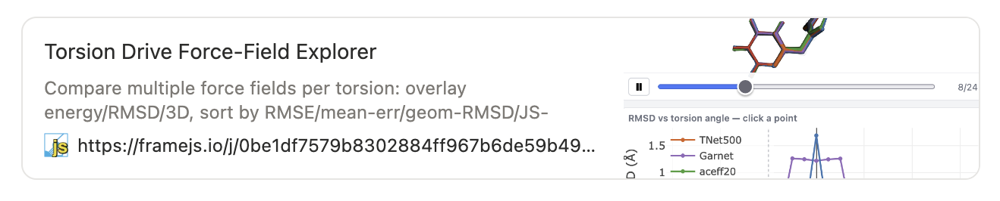

## Embed anywhere 

```html
<iframe src="https://framejs.io/j/8c6a01…" width="100%" height="500"></iframe>
```

<div class="targets">
  <span>Notion</span><span>Obsidian</span><span>Confluence</span><span>Google Docs</span><span>Jupyter</span><span>Any website</span>
</div>

- It's a **cross-origin iframe** — sandboxed by default, so it's safe to embed
  and even let users edit.
- Looks good: links **unfurl** with an Open Graph title, description, and preview image in
  Slack, Discord, and social (autogenerated from AI)


`
Note: Because the whole app is one URL, embedding is just an iframe. It works in
Notion, Obsidian, Confluence, Google Docs, Jupyter, your own docs site —
anywhere that accepts an embed. And because the iframe is cross-origin and
sandboxed, you can safely let users edit the code running inside your page; the
blast radius is the iframe. Shared links also unfurl nicely with Open Graph
previews.
