<!-- .slide: class="title-slide" -->

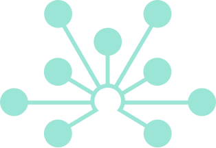

<span class="kicker">OMSF Office Hours · July 2026</span>

# framejs.io <!-- .element: class="accent" -->

### AI Interactive Visualizations that live in a URL

<p class="byline">Dion Whitehead · Open Molecular Software Foundation</p>

<div class="image-strip">
  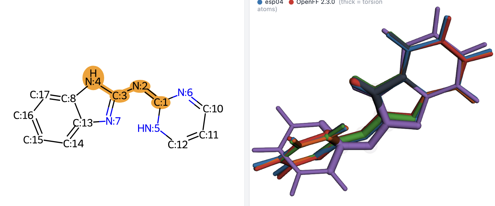
  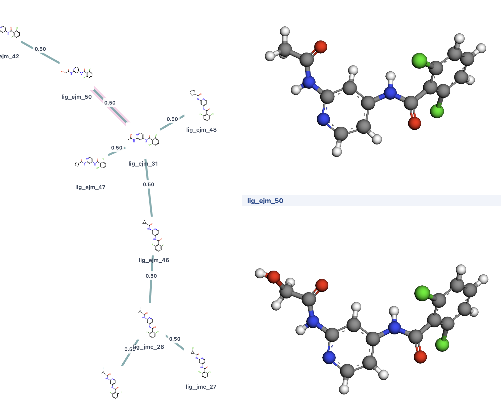
  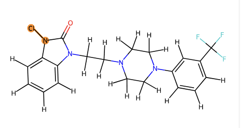
  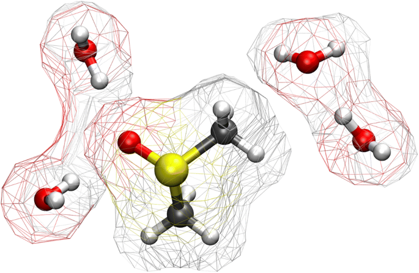
  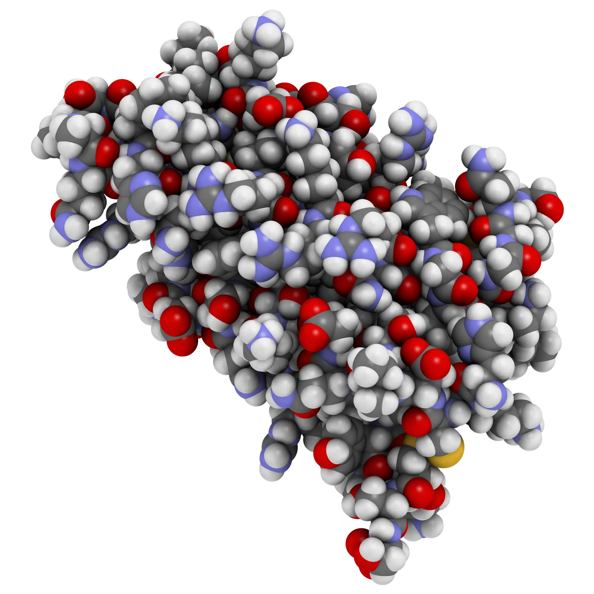
</div>

Note: Welcome. This is a hands-on workshop. Over the next ~25 minutes I'll show
you framejs.io — a tiny web primitive for building interactive scientific
visualizations that are editable, embeddable, and shareable as a single URL.
We'll cover what it is, how data is stored, the AI integration — which is the
real point — and how it drops into notebooks. Then you'll build one yourself.

---

## What we'll do today

- **Overview** — what framejs is, and the objective behind it
- **AI integration** — describe it, an agent builds it
- **Examples in the OMSF stack** — force-field benchmarking, free energy,
  structures
- **Hands-on** — install a skill, point Claude Code at a data file, ship a link

<p class="concl">Goal: leave able to turn a local data file into a shareable, interactive visualization in one prompt.</p>

<div class="image-strip">
  
  
  
  
  
</div>

<!-- - **Discussion:**
  - **Data storage** — why the URL _is_ the program
  - **Notebook integration (Preview)** — any visualization → a live Jupyter
    widget -->

Note: Here's the arc. It's deliberately light on theory and heavy on doing. The
single thing I want you to walk out with: a local data file becoming a live,
interactive, shareable visualization from one natural-language prompt — and
knowing how to embed it in a notebook or a page.


---

<!-- ══════════════════════════════════════════════════════════════════════════
     ALTERNATIVE B — the flattening flow. Tells it as a sequence: the live
     thing, the act of screenshotting, the corpse, and what was lost.
     Strongest narrative version; good if you want to say it out loud.
     ══════════════════════════════════════════════════════════════════════ -->

<!-- .slide: class="top-align" -->

## Interactive results do not survive your local machine

<div class="flatten-flow">

  <figure class="flat-step">
    <div class="flat-card live">
      <span class="tag"><span class="led"></span>live · on your machine</span>
      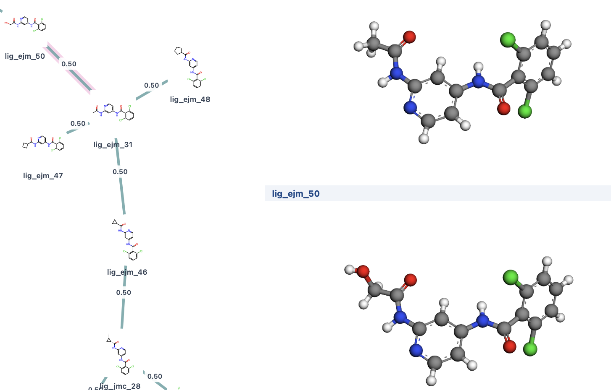
    </div>
    <figcaption><strong>You built interactivity:</strong> pan, zoom, hover, filter, linked views</figcaption>
  </figure>

  <span class="flat-arrow">→</span>

  <figure class="flat-step">
    <div class="flat-card shutter">
      <svg viewBox="0 0 24 24"><path d="M9 3l-1.5 2H4a2 2 0 00-2 2v12a2 2 0 002 2h16a2 2 0 002-2V7a2 2 0 00-2-2h-3.5L15 3H9zm3 5.5a5 5 0 110 10 5 5 0 010-10zm0 2a3 3 0 100 6 3 3 0 000-6z"/></svg>
      <span class="shutter-label">⌘⇧4</span>
    </div>
    <figcaption><strong>The only way to share it: </strong> screenshot, export, paste</figcaption>
  </figure>

  <span class="flat-arrow">→</span>

  <figure class="flat-step">
    <div class="flat-card flat">
      <span class="tag dead">static .png</span>
      
    </div>
    <figcaption><strong>A static image </strong> lands in the notebook, the slide, the paper, the Slack thread</figcaption>
  </figure>

  <span class="flat-arrow">→</span>

  <figure class="flat-step">
    <div class="flat-card dead">
      <span class="lost">explore it yourself</span>
      <span class="lost">re-point it at new data</span>
      <span class="lost">fork it, extend it</span>
      <span class="lost">embed it anywhere live</span>
      <span class="lost">reproduce the figure</span>
    </div>
    <figcaption><strong>What's gone: </strong> the ability for the reader to follow up question</figcaption>
  </figure>

</div>

<p class="concl">The interactive visualization is the part of open science that still ships flattened</p>

---

<!-- ══════════════════════════════════════════════════════════════════════════
     ALTERNATIVE C — the gap matrix. Densest and most "evidence-like": every
     destination researchers actually use, and what survives arriving there.
     Reads as a wall of red without a word of complaint.
     ══════════════════════════════════════════════════════════════════════ -->

<!-- .slide: class="top-align" -->

## The visualization pain point of OMSF tools

<table class="gap-matrix">
  <thead>
    <tr>
      <th>Where the result has to go</th>
      <th>What you ship</th>
      <th>Interactive</th>
      <th>Standard</th>
      <th>Portable</th>
      <th>Embeddable</th>
    </tr>
  </thead>
  <tbody>
    <tr>
      <td><span class="where"><svg viewBox="0 0 24 24" fill="#F37726"><path d="M7.157 22.201A1.784 1.799 0 0 1 5.374 24a1.784 1.799 0 0 1-1.784-1.799 1.784 1.799 0 0 1 1.784-1.799 1.784 1.799 0 0 1 1.783 1.799zM20.582 1.427a1.415 1.427 0 0 1-1.415 1.428 1.415 1.427 0 0 1-1.416-1.428A1.415 1.427 0 0 1 19.167 0a1.415 1.427 0 0 1 1.415 1.427zM4.992 3.336A1.047 1.056 0 0 1 3.946 4.39a1.047 1.056 0 0 1-1.047-1.055A1.047 1.056 0 0 1 3.946 2.28a1.047 1.056 0 0 1 1.046 1.056zm7.336 1.74c3.769 0 7.06 1.336 8.768 3.319a9.62 9.62 0 0 0-3.398-4.93A9.522 9.602 0 0 0 12.328 1.815 9.522 9.602 0 0 0 6.93 3.394 9.62 9.62 0 0 0 3.55 8.323c1.717-1.983 4.999-3.247 8.778-3.247zm.043 13.898c-3.769 0-7.06-1.336-8.768-3.32a9.62 9.62 0 0 0 3.398 4.931 9.522 9.602 0 0 0 5.37 1.65 9.522 9.602 0 0 0 5.4-1.583 9.62 9.62 0 0 0 3.38-4.929c-1.718 1.983-5 3.247-8.78 3.247z"/></svg><span>Jupyter / marimo<span class="sub">a colleague's notebook</span></span></span></td>
      <td><span class="shipped">widget + env</span></td>
      <td><span class="yes">✅</span></td>
      <td><span class="no">✕</span></td>
      <td><span class="no">✕</span></td>
      <td><span class="no">✕</span></td>
    </tr>
    <tr>
      <td><span class="where"><svg viewBox="0 0 24 24" fill="currentColor"><path d="M3 4h18a1 1 0 011 1v14a1 1 0 01-1 1H3a1 1 0 01-1-1V5a1 1 0 011-1zm3 4.4L9.6 12 6 15.6 7.4 17l5-5-5-5L6 8.4zM13 15.6V17.5h5V15.6h-5z"/></svg><span>Terminal / CLI<span class="sub">whatever browser is on the host</span></span></span></td>
      <td><span class="shipped">local html file</span></td>
      <td><span class="part">~</span></td>
      <td><span class="no">✕</span></td>
      <td><span class="no">✕</span></td>
      <td><span class="no">✕</span></td>
    </tr>
    <tr>
      <td><span class="where"><svg viewBox="0 0 122.8 122.8"><path d="M25.8 77.6c0 7.1-5.8 12.9-12.9 12.9S0 84.7 0 77.6s5.8-12.9 12.9-12.9h12.9v12.9zm6.5 0c0-7.1 5.8-12.9 12.9-12.9s12.9 5.8 12.9 12.9v32.3c0 7.1-5.8 12.9-12.9 12.9s-12.9-5.8-12.9-12.9V77.6z" fill="#E01E5A"/><path d="M45.2 25.8c-7.1 0-12.9-5.8-12.9-12.9S38.1 0 45.2 0s12.9 5.8 12.9 12.9v12.9H45.2zm0 6.5c7.1 0 12.9 5.8 12.9 12.9s-5.8 12.9-12.9 12.9H12.9C5.8 58.1 0 52.3 0 45.2s5.8-12.9 12.9-12.9h32.3z" fill="#36C5F0"/><path d="M97 45.2c0-7.1 5.8-12.9 12.9-12.9s12.9 5.8 12.9 12.9-5.8 12.9-12.9 12.9H97V45.2zm-6.5 0c0 7.1-5.8 12.9-12.9 12.9s-12.9-5.8-12.9-12.9V12.9C64.7 5.8 70.5 0 77.6 0s12.9 5.8 12.9 12.9v32.3z" fill="#2EB67D"/><path d="M77.6 97c7.1 0 12.9 5.8 12.9 12.9s-5.8 12.9-12.9 12.9-12.9-5.8-12.9-12.9V97h12.9zm0-6.5c-7.1 0-12.9-5.8-12.9-12.9s5.8-12.9 12.9-12.9h32.3c7.1 0 12.9 5.8 12.9 12.9s-5.8 12.9-12.9 12.9H77.6z" fill="#ECB22E"/></svg><span>Slack / chat<span class="sub">the actual unit of collaboration</span></span></span></td>
      <td><span class="shipped">screenshot.png</span></td>
      <td><span class="no">✕</span></td>
      <td><span class="no">✕</span></td>
      <td><span class="yes">✅</span></td>
      <td><span class="yes">✅</span></td>
    </tr>
    <tr>
      <td><span class="where"><svg viewBox="0 0 24 24" fill="currentColor"><path d="M6 2h9l5 5v13a2 2 0 01-2 2H6a2 2 0 01-2-2V4a2 2 0 012-2zm8 1.5V8h4.5L14 3.5zM8 11h8v1.6H8V11zm0 3.4h8V16H8v-1.4zm0 3.4h5v1.6H8v-1.6z"/></svg><span>Paper / docs<span class="sub">the permanent record</span></span></span></td>
      <td><span class="shipped">figure 3.png</span></td>
      <td><span class="no">✕</span></td>
      <td><span class="no">✕</span></td>
      <td><span class="no">✕</span></td>
      <td><span class="no">✕</span></td>
    </tr>
    <tr>
      <td><span class="where"><svg viewBox="0 0 24 24" fill="currentColor"><path d="M4 3h16a1 1 0 011 1v16a1 1 0 01-1 1H4a1 1 0 01-1-1V4a1 1 0 011-1zm1 4v12h14V7H5zm2 2h6v4H7V9zm0 6h10v1.5H7V15z"/></svg><span>Slides / blog<span class="sub">every talk like this one</span></span></span></td>
      <td><span class="shipped">screenshot.png</span></td>
      <td><span class="no">✕</span></td>
      <td><span class="no">✕</span></td>
      <td><span class="no">✕</span></td>
      <td><span class="part">~</span></td>
    </tr>
  </tbody>
</table>

<p class="concl">Five destinations, five different exports, and the interactivity only survives one of them</p>

---

<!-- ══════════════════════════════════════════════════════════════════════════
     ALTERNATIVE D — the split, status quo first. Left is the format everyone
     actually receives today; right is what framejs hands over instead. One
     image, two fates. Most visceral and the fastest to read; least information
     per slide, so pair it with the notes.
     ══════════════════════════════════════════════════════════════════════ -->

<!-- .slide: class="top-align" -->

## How results get shared today - and what we built to replace

<div class="pain-split">

  <figure class="split-side flat">
    <div class="split-shot">
      <span class="stamp">how it's shared today</span>
      
    </div>
    <div class="caps">
      <span>pan &amp; zoom</span>
      <span>hover detail</span>
      <span>filter</span>
      <span>linked views</span>
      <span>re-point at new data</span>
      <span>fork &amp; extend</span>
    </div>
    <figcaption><strong>A picture of a tool</strong> — the lowest common denominator every notebook, paper, slide and Slack thread accepts</figcaption>
  </figure>

  <span class="split-op">→</span>

  <figure class="split-side live">
    <div class="split-shot">
      <span class="stamp">what we built</span>
      
    </div>
    <div class="caps">
      <span>pan &amp; zoom</span>
      <span>hover detail</span>
      <span>filter</span>
      <span>linked views</span>
      <span>re-point at new data</span>
      <span>fork &amp; extend</span>
      <span class="new">+ paste anywhere</span>
      <span class="new">+ data rides along</span>
      <span class="new">+ editable by anyone</span>
    </div>
    <figcaption><strong>The tool itself</strong> — the same link, still live in all four of those places</figcaption>
  </figure>

</div>

<p class="concl">The unit of sharing stops being an image of the result and becomes the result.</p>

Note: Everyone in this room already knows the left-hand panel — it's what you
send when a colleague asks to see your figure. It's the lowest common
denominator: the one format a notebook, a paper, a slide and a Slack thread will
all accept. And everything that made the figure worth building — pan, zoom,
hover, the linked views, the ability to point it at your own data — is gone by
the time it arrives. The right-hand panel is the same visualization shared as a
URL instead of a PNG. Every capability survives, the data travels with it, and
it lands live in exactly the same four places. That's the whole idea: the unit
of sharing stops being a picture of the result and becomes the result.

---

<!-- .slide: class="top-align" -->

## Sharing only works if the unit is self-contained

<div class="selfcontained">

<div class="fragments">
  <span class="frag-label">Today, “here's the visualization” is a pile of things that must all arrive — and match</span>
  <span class="frag">notebook.ipynb</span><span class="plus">+</span>
  <span class="frag">environment.yml</span><span class="plus">+</span>
  <span class="frag">data/</span><span class="plus">+</span>
  <span class="frag">widget extension</span><span class="plus">+</span>
  <span class="frag">a compatible kernel</span><span class="plus">+</span>
  <span class="frag">the same library versions</span>
  <span class="eq">→</span>
  <span class="frag-out">…maybe it renders</span>
</div>

<div class="parcel-row">

  <div class="parcel">
    <div class="parcel-bar">framejs.io/j/<span class="var">8c6a0119bddd…</span></div>
    <ul class="parcel-contents">
      <li>
        <span class="pi"><svg viewBox="0 0 24 24"><path d="M9.4 16.6L4.8 12l4.6-4.6L8 6l-6 6 6 6 1.4-1.4zm5.2 0l4.6-4.6-4.6-4.6L16 6l6 6-6 6-1.4-1.4z"/></svg></span>
        <span class="pt"><strong>The code</strong><span>the program that draws it — not a build of it</span></span>
      </li>
      <li>
        <span class="pi"><svg viewBox="0 0 24 24"><path d="M12 2c-4.4 0-8 1.3-8 3v14c0 1.7 3.6 3 8 3s8-1.3 8-3V5c0-1.7-3.6-3-8-3zm0 2c3.9 0 6 1 6 1s-2.1 1-6 1-6-1-6-1 2.1-1 6-1zm6 15s-2.1 1-6 1-6-1-6-1v-2.6c1.6.7 3.8 1.1 6 1.1s4.4-.4 6-1.1V19zm0-5s-2.1 1-6 1-6-1-6-1v-2.6c1.6.7 3.8 1.1 6 1.1s4.4-.4 6-1.1V14zm0-5s-2.1 1-6 1-6-1-6-1V6.4C7.6 7.1 9.8 7.5 12 7.5s4.4-.4 6-1.1V9z"/></svg></span>
        <span class="pt"><strong>The data</strong><span>the inputs, content-addressed and travelling with it</span></span>
      </li>
      <li>
        <span class="pi"><svg viewBox="0 0 24 24"><path d="M12 2a10 10 0 100 20 10 10 0 000-20zm6.9 6h-2.6a15.7 15.7 0 00-1.4-3.6A8 8 0 0118.9 8zM12 4c.8 0 1.9 1.6 2.5 4H9.5C10.1 5.6 11.2 4 12 4zM4.3 14a8 8 0 010-4h3a18 18 0 000 4h-3zm.8 2h2.6a15.7 15.7 0 001.4 3.6A8 8 0 015.1 16zm2.6-8H5.1a8 8 0 014-3.6A15.7 15.7 0 007.7 8zM12 20c-.8 0-1.9-1.6-2.5-4h5c-.6 2.4-1.7 4-2.5 4zm2.9-6H9.1a16 16 0 010-4h5.8a16 16 0 010 4zm.4 5.6a15.7 15.7 0 001.4-3.6h2.6a8 8 0 01-4 3.6zM16.7 14a18 18 0 000-4h3a8 8 0 010 4h-3z"/></svg></span>
        <span class="pt"><strong>The runtime</strong><span>a browser — the one thing every recipient already has</span></span>
      </li>
      <li>
        <span class="pi"><svg viewBox="0 0 24 24"><path d="M3 17.2V21h3.8L17.8 10 14 6.2 3 17.2zM20.7 7.1a1 1 0 000-1.4l-2.4-2.4a1 1 0 00-1.4 0l-1.8 1.8L18.9 8.9l1.8-1.8z"/></svg></span>
        <span class="pt"><strong>The edit surface</strong><span>the source is open in the page — the recipient can change it</span></span>
      </li>
    </ul>
    <p class="parcel-foot">One string of text. Nothing else has to arrive, and nothing can go missing.</p>
  </div>

  <div class="verbs">
    <div class="verb">
      <span class="vn">Render</span>
      <p>Opens on any machine, for anyone, first try — no setup step between them and the result.</p>
    </div>
    <div class="verb">
      <span class="vn">Interact</span>
      <p>Pan, zoom, filter, select — they can ask the figure their own questions, not just yours.</p>
    </div>
    <div class="verb">
      <span class="vn">Edit</span>
      <p>Fork it, re-point it at their data, hand it to an agent — the link is a starting point, not a dead end.</p>
    </div>
    <p class="nothing"><b>Not required:</b> an environment · a kernel · a server · an account · a build step · your machine</p>
  </div>

</div>

</div>

<p class="concl">If it isn't self-contained, the cost to reproduce is too high</p>

Note: This is the principle underneath everything else in the talk, so it's
worth stating plainly. Sharing only counts if the thing you send is
self-contained — if it carries everything needed to render, to interact, and to
edit. The strip along the top is what "here's the visualization" usually means
today: a notebook, plus an environment file, plus the data directory, plus a
widget extension, plus a compatible kernel, plus matching library versions — all
of which have to arrive together and agree with each other, and if any one is
missing or mismatched you get nothing. That's not a share, it's a request for
the other person to reproduce your setup. The parcel below is the alternative:
one URL that holds the code, the data, the runtime, and the edit surface. The
code is the program itself, not a build artifact. The data is content-addressed
and rides along. The runtime is the browser, which is the one thing every
recipient already has. And the source is open in the page, so whoever you sent
it to can change it. That's what buys you the three verbs on the right: it
renders first try, it stays interactive so they can ask their own questions of
it, and it's editable so the link is a starting point rather than a dead end.
No environment, no kernel, no server, no account, no build, and crucially — not
your machine.

---

<div class="two-col lean-left">
<div>

## What is framejs?

- An **embeddable, editable open-source web app** that runs one chunk of JavaScript in the
  browser.
- Generate visualizations with AI directly in the terminal
- The whole app is **encoded in the URL**. The URL _is_ the program (self-contained).
- Embed anywhere: LinkedIn, Notion, Obsidian, Jupyter, your own site. Title, description, screenshot autogenerated

<p class="concl">A user-centric visualization web primitive</p>

</div>

<div class="iframe-scroll" style="max-height:900px;height:900px">
  <iframe data-src="https://framejs.io/j/8e5d5eed5c3fda9c5094b186169feadecde2bf007fcd58b7fa0df52e3e3c34be" height="760" title="framejs visualization demo" allow="clipboard-read; clipboard-write"></iframe>
</div>
</div>

Note: framejs is small on purpose. You write an ES6 module — JavaScript that
runs in a sandboxed iframe — and the entire app is encoded into the URL. There's
no build step, no deploy, no login. Open the link, it runs. On the right is a
live framejs page, embedded right in this slide. Everything you'll see today is
the same primitive.


---

<!-- .slide: class="two-col lean-left" -->

<div>

## AI can create complex interactive visualizations <span class="muted"></span>

<div class="two-col lean-left">
<div>

<p class="prompt"><span class="p">&gt;</span> show a range of visualizations<br>&nbsp;&nbsp;with a slider, for molecular<br>&nbsp;&nbsp;science and structural biology<br><span class="o">→ https://framejs.io/j/048578…  (opened)</span> </p>

Describe what you want in plain language. An agent writes the JavaScript, mints
a short URL, and opens it.

- Works with **Claude, ChatGPT, or any LLM**
- One portable **Agent Skill** across ~40 harnesses
- Create from a prompt · modify an existing link · visualize a local file


</div>

<div class="embed-frame">
  <iframe data-src="https://framejs.io/j/567dcffe9570ebc5d5f17731b2bb8282a2ad277de989d6c773c56df684380b68" height="700" title="AI-generated framejs visualization" allow="clipboard-read; clipboard-write"></iframe>
</div>

</div>

Note: This is the part that changes how it feels to use. You don't write the
JavaScript — you describe the result. The visualization on the right was created
from a single sentence: "show a range of visualizations with a slider, for
molecular science and structural biology." The agent generated the code — a
linked-views explorer of real ubiquitin (1UBQ), parsed live in the browser: a 3D
structure, a Ramachandran map, a Cα contact matrix, and a B-factor track that
all share one residue selection. Hover or click a residue in any panel and it
lights up in the others; a colour-by control and a contact-distance slider drive
every panel together. The agent created the short URL and opened it. Same skill
handles three jobs: create from a prompt, modify an existing link, or visualize
a local data file.

---

## Install the framejs Agent Skill — one line

```bash
curl -fsSL https://framejs.io/skill/install.sh | sh
```

It auto-routes by what your agent can do:

- **Shell / coding agents** (Claude Code, Codex, Gemini CLI…) → generate the JS,
  **create + open a short URL**.
- **Chat / API agents** (no shell) → return the **JavaScript to paste** into the
  editor.

<p class="muted">Installs to <code>~/.claude/skills</code> by default — pass any other harness's skills dir as an argument. Re-run any time to update.</p>

<p class="concl"><a href="https://framejs.io/docs">https://framejs.io/docs</a></span></p>

Note: One command installs the skill. A skill is just a portable SKILL.md folder
— it works across about forty agent harnesses. It's capability-aware: if the
agent has a shell, it builds the short URL and opens your browser; if it's a
chat-only agent, it hands back the JavaScript to paste. For this workshop we'll
use Claude Code, so it'll be the full create-and-open flow.

---

## The app _is_ the URL

<div class="url-ways">

<div class="url-card">
  <span class="state">Work in progress: local</span>
  <p class="url">framejs.io/<span class="var">#js=&lt;your code&gt;</span></p>
  <ul>
    <li>Code lives in the <strong>hash</strong></li>
    <li><strong>Never</strong> sent to a server</li>
  </ul>
</div>

<div class="url-card">
  <span class="state">Work in progress: temporary and shareable</span>
  <p class="url">framejs.io/j/<span class="var">&lt;sha256&gt;</span></p>
  <ul>
    <li>A unique, immutable page</li>
    <li>Content-addressed short URL</li>
    <li>30 day lifespan, then <strong>expires</strong></li>
  </ul>
</div>

<div class="url-card live">
  <span class="state">Saved &amp; shareable, mutable</span>
  <p class="url">framejs.io/j/<span class="var">&lt;uuid&gt;</span></p>
  <ul>
    <li>Unique address</li>
    <li>Content can change</li>
    <li>Can be private</li>
    <li>Stores state in <strong>framejs.app</strong></li>
  </ul>
</div>

<div class="url-card">
  <span class="state">Saved &amp; shareable; durable</span>
  <p class="url">framejs.io/j/<span class="var">&lt;uuid&gt;</span>?v=<span class="var">&lt;sha256&gt;</span></p>
  <ul>
    <li>A unique, immutable durable page</li>
    <li>Cannot be edited, published forever</li>
  </ul>
</div>

</div>

<p class="concl">Same app, different URLs depending on data lifecycle <span class="muted">framejs.io/docs</span></p>

Note: One idea, worth pausing on: there is no database — the app lives in the
URL itself, and it's saved in one of two forms. While you're working, the entire
program sits in the URL hash — the part after the `#` that the browser never
sends to a server. It's live, it's private, it updates as you edit. When you
want to share it, the shortener stores the bundle content-addressed and hands
back framejs.io/j/ plus a sha256 — a unique, immutable page anyone can open. Same
app, two URLs: one private and in-progress, one fixed and shareable. Details and
the API are in the docs.

---

## One frame, live-updating — then claim it to keep

<div class="two-col lean-left">

<div>

- The agent mints **one frame per session** — a stable `framejs.app/j/<uuid>`
  page that **updates live** as it iterates. You get the link **once**.
- Watch the visualization change in your open tab while you keep prompting — no
  new tab, no copy-paste, no rebuild.
- An anonymous frame is **temporary**. **Claim it** (free account) and it becomes
  a **durable Frame** with version history.
- **Hand it back to an agent later:** *Copy frame for AI session* passes a token,
  so Claude can keep editing a frame **you already own**.

<p class="concl">One living URL through the whole session — share it, claim it, re-open it in an agent.</p>

</div>

<div class="browser-frame">
  <div class="browser-bar">
    <div class="browser-dots">
      <span class="dot red"></span>
      <span class="dot yellow"></span>
      <span class="dot green"></span>
    </div>
    <div class="browser-address">framejs.app/j/019f3ad1…  ·  live</div>
  </div>
  <div class="embed-frame">
    <iframe data-src="https://framejs.io/j/567dcffe9570ebc5d5f17731b2bb8282a2ad277de989d6c773c56df684380b68" height="700" title="Live-updating framejs frame" allow="clipboard-read; clipboard-write"></iframe>
  </div>
</div>

</div>

Note: A detail that changes the feel of a working session. The agent doesn't
spray out a new link per edit — it mints one frame per session, a stable
framejs.app/j/<uuid> page, and updates it in place. You get the URL once, open
it, and it changes live in that same tab every time you prompt — no new tabs, no
copy-paste. That anonymous frame is temporary, so when you have something worth
keeping you claim it with a free account and it becomes a durable Frame with full
version history. And it goes the other direction too: "Copy frame for AI session"
hands an agent a token for a frame you already own, so Claude can keep editing it
after you've claimed it. One living URL through the whole workflow.

---

<!-- .slide: class="hub-slide" -->

## Share / embed anywhere

<div class="hub">

<svg class="spokes" viewBox="0 0 1640 860" preserveAspectRatio="none">
  <line x1="820" y1="490" x2="820" y2="150"></line>
  <line x1="820" y1="490" x2="1420" y2="360"></line>
  <line x1="820" y1="490" x2="1420" y2="720"></line>
  <line x1="820" y1="490" x2="220" y2="720"></line>
  <line x1="820" y1="490" x2="220" y2="360"></line>
</svg>

<div class="hub-core">
  
</div>

<div class="embed-card n1" title="Notebooks (Jupyter / marimo)">
  <div class="shot">
    
  </div>
  <div class="brand-badge"><svg viewBox="0 0 24 24" fill="#F37726" aria-label="Jupyter / marimo notebooks"><path d="M7.157 22.201A1.784 1.799 0 0 1 5.374 24a1.784 1.799 0 0 1-1.784-1.799 1.784 1.799 0 0 1 1.784-1.799 1.784 1.799 0 0 1 1.783 1.799zM20.582 1.427a1.415 1.427 0 0 1-1.415 1.428 1.415 1.427 0 0 1-1.416-1.428A1.415 1.427 0 0 1 19.167 0a1.415 1.427 0 0 1 1.415 1.427zM4.992 3.336A1.047 1.056 0 0 1 3.946 4.39a1.047 1.056 0 0 1-1.047-1.055A1.047 1.056 0 0 1 3.946 2.28a1.047 1.056 0 0 1 1.046 1.056zm7.336 1.74c3.769 0 7.06 1.336 8.768 3.319a9.62 9.62 0 0 0-3.398-4.93A9.522 9.602 0 0 0 12.328 1.815 9.522 9.602 0 0 0 6.93 3.394 9.62 9.62 0 0 0 3.55 8.323c1.717-1.983 4.999-3.247 8.778-3.247zm.043 13.898c-3.769 0-7.06-1.336-8.768-3.32a9.62 9.62 0 0 0 3.398 4.931 9.522 9.602 0 0 0 5.37 1.65 9.522 9.602 0 0 0 5.4-1.583 9.62 9.62 0 0 0 3.38-4.929c-1.718 1.983-5 3.247-8.78 3.247z"/></svg></div>
</div>

<div class="embed-card n2" title="Slack">
  <div class="shot">
    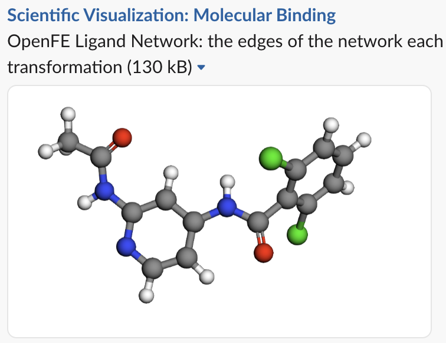
  </div>
  <div class="brand-badge"><svg viewBox="0 0 122.8 122.8" aria-label="Slack"><path d="M25.8 77.6c0 7.1-5.8 12.9-12.9 12.9S0 84.7 0 77.6s5.8-12.9 12.9-12.9h12.9v12.9zm6.5 0c0-7.1 5.8-12.9 12.9-12.9s12.9 5.8 12.9 12.9v32.3c0 7.1-5.8 12.9-12.9 12.9s-12.9-5.8-12.9-12.9V77.6z" fill="#E01E5A"/><path d="M45.2 25.8c-7.1 0-12.9-5.8-12.9-12.9S38.1 0 45.2 0s12.9 5.8 12.9 12.9v12.9H45.2zm0 6.5c7.1 0 12.9 5.8 12.9 12.9s-5.8 12.9-12.9 12.9H12.9C5.8 58.1 0 52.3 0 45.2s5.8-12.9 12.9-12.9h32.3z" fill="#36C5F0"/><path d="M97 45.2c0-7.1 5.8-12.9 12.9-12.9s12.9 5.8 12.9 12.9-5.8 12.9-12.9 12.9H97V45.2zm-6.5 0c0 7.1-5.8 12.9-12.9 12.9s-12.9-5.8-12.9-12.9V12.9C64.7 5.8 70.5 0 77.6 0s12.9 5.8 12.9 12.9v32.3z" fill="#2EB67D"/><path d="M77.6 97c7.1 0 12.9 5.8 12.9 12.9s-5.8 12.9-12.9 12.9-12.9-5.8-12.9-12.9V97h12.9zm0-6.5c-7.1 0-12.9-5.8-12.9-12.9s5.8-12.9 12.9-12.9h32.3c7.1 0 12.9 5.8 12.9 12.9s-5.8 12.9-12.9 12.9H77.6z" fill="#ECB22E"/></svg></div>
</div>

<div class="embed-card n3" title="Website / blog">
  <div class="shot">
    
  </div>
  <div class="brand-badge"><svg viewBox="0 0 24 24" fill="#1A73E8" aria-label="Website or blog"><path d="M12 2a10 10 0 100 20 10 10 0 000-20zm6.9 6h-2.6a15.7 15.7 0 00-1.4-3.6A8 8 0 0118.9 8zM12 4c.8 0 1.9 1.6 2.5 4H9.5C10.1 5.6 11.2 4 12 4zM4.3 14a8 8 0 010-4h3a18 18 0 000 4h-3zm.8 2h2.6a15.7 15.7 0 001.4 3.6A8 8 0 015.1 16zm2.6-8H5.1a8 8 0 014-3.6A15.7 15.7 0 007.7 8zM12 20c-.8 0-1.9-1.6-2.5-4h5c-.6 2.4-1.7 4-2.5 4zm2.9-6H9.1a16 16 0 010-4h5.8a16 16 0 010 4zm.4 5.6a15.7 15.7 0 001.4-3.6h2.6a8 8 0 01-4 3.6zM16.7 14a18 18 0 000-4h3a8 8 0 010 4h-3z"></path></svg></div>
</div>

<div class="embed-card n4" title="QR code">
  <div class="shot">
    
  </div>
  <div class="brand-badge"><svg viewBox="0 0 24 24" fill="currentColor" aria-label="QR code"><path d="M3 3h8v8H3V3zm2 2v4h4V5H5zm-2 8h8v8H3v-8zm2 2v4h4v-4H5zM13 3h8v8h-8V3zm2 2v4h4V5h-4zM13 13h2v2h-2v-2zm2 2h2v2h-2v-2zm-2 2h2v2h-2v-2zm4 0h2v2h-2v-2zm2 2h-2v-2h2v2zm0-4h-2v2h2v-2zm0-2h-2v2h2v-2zm-4 0h2v2h-2v-2z"/></svg></div>
  <p class="url-caption">framejs.io/j/&lt;sha256&gt;<span class="var">/qrcode.png</span></p>
</div>

<div class="embed-card n5" title="LinkedIn">
  <div class="shot">
    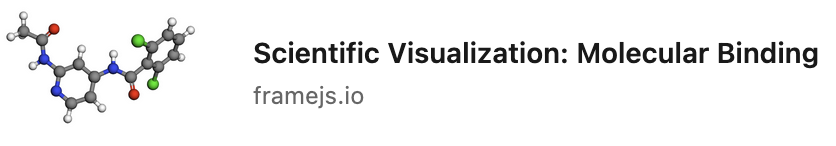
  </div>
  <div class="brand-badge"><svg viewBox="0 0 24 24" fill="#0A66C2" aria-label="LinkedIn"><path d="M20.447 20.452h-3.554v-5.569c0-1.328-.027-3.037-1.852-3.037-1.853 0-2.136 1.445-2.136 2.939v5.667H9.351V9h3.414v1.561h.046c.477-.9 1.637-1.85 3.37-1.85 3.601 0 4.267 2.37 4.267 5.455v6.286zM5.337 7.433a2.062 2.062 0 01-2.063-2.065 2.064 2.064 0 112.063 2.065zm1.782 13.019H3.555V9h3.564v11.452zM22.225 0H1.771C.792 0 0 .774 0 1.729v20.542C0 23.227.792 24 1.771 24h20.451C23.2 24 24 23.227 24 22.271V1.729C24 .774 23.2 0 22.225 0z"/></svg></div>
</div>

</div>

<br/>


<!-- <p class="concl">(AI) generated title + description + screenshot rendered in embeds</p> -->

Note:
- Links **unfurl** in Slack, Discord, and socials
- Title, description, and preview image generated by AI 
- **Cross-origin iframe** — sandboxed by default, so it's safe to embed
  and even let users edit.
One visualization, everywhere. Because the whole thing is a single URL,
the same live page drops straight into a Jupyter or marimo notebook, shares to
Slack, goes out in an email, posts to LinkedIn, or embeds in any website or
blog — no export, no screenshot, no rebuild. It stays interactive wherever it
lands.

---

## Paste link example

<div class="paste-stack">
  <figure class="paste-step">
    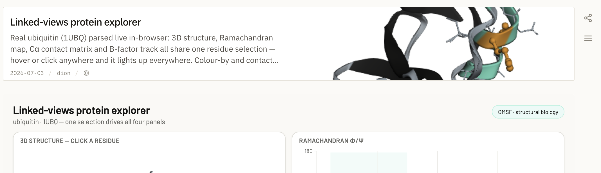
    <figcaption>1 · Copy the frame link</figcaption>
  </figure>
  <figure class="paste-step">
    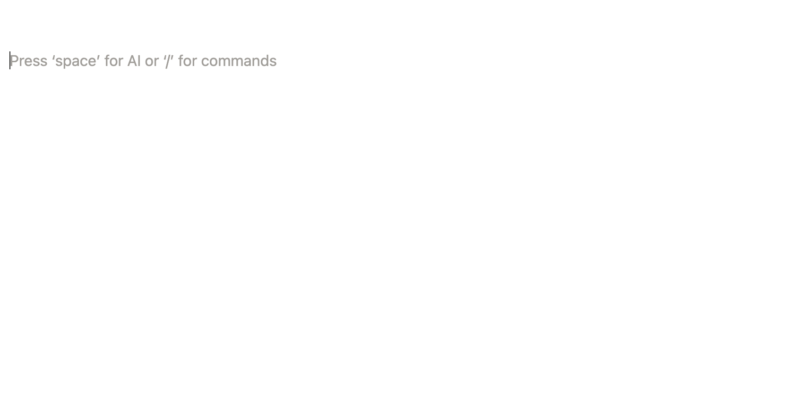
    <figcaption>2 · Paste into Notion — it renders live</figcaption>
  </figure>
</div>

Note:
Copy the link from framejs, paste it into Notion, and it unfurls into a live,
interactive embed — no export, no screenshot.


---

## Live: a Claude Code session with local files

<p class="prompt"><span class="p">&gt;</span> <span class="u">visualize ./network.graphml as an interactive ligand network</span><br><br><span class="o">• reads network.graphml — understands the structure</span><br><span class="o">• uploads it (content-addressed) → framejs.io/f/…</span><br><span class="o">• generates browser JS, wires the file in as an input</span><br><span class="o">• POST /api/shorten/json → mints the short URL</span><br><span class="o">→ https://framejs.io/j/8c6a01…  (opened in browser)</span></p>

- **No HTML files, no local `.js`. No build.** The output is a shareable
  link.
- **The data rides along, no local files needed:** anyone who opens it has everything for the visualization.

<p class="concl"><a href="https://framejs.io/docs">https://framejs.io/docs</a></span></p>

Note: Here's the actual flow with a local file — exactly what you'll do in the
hands-on. You point Claude Code at a file and say what you want. The agent reads
the file to understand its shape, uploads it (content-addressed, so the same
bytes always give the same URL), generates the browser JavaScript, wires the
file in as an input, and mints the short URL. Crucially it writes no HTML, no
build config, no local JS. The deliverable is a link that's fully standalone —
the data travels with it.

---

<!-- .slide: class="top-align" -->

<div class="two-col lean-left">

<div>

## Frames on your disk — offline &amp; in git

- A frame is just its URL, and a URL is just text — so it can live in a
  **folder, in git, on a USB stick**.
- **Local server** (`deno` or `docker`): renders your disk as a file browser; open a frame
  folder and every edit **auto-saves back to disk** — nothing on a server.


<p class="concl">Version frames like code — real line-by-line diffs of <code>code.js</code>, fully offline or self-hosted.</p>

</div>

<div class="nb-body">

```text
my-frame/            ◆ FRAME
├── code.js          ← real diffs in git
├── options.json
└── inputs/
    └── network.graphml
```

<p class="muted">Runs straight from GitHub with <code>deno</code> or <code>docker</code>. Mount a folder in Docker and everything under it is browsable and writable.</p>

</div>

</div>

Note: For people who want version control, this is the piece that closes it.
Because a frame is nothing but its URL, and a URL is just text, a frame can live
on disk — in a folder, committed to git, on a USB stick. Two ways in: a tiny
local server, one Deno file you can run straight from GitHub, that renders your
disk as a file browser — open a frame folder and every edit auto-saves back to
disk, with nothing stored on any server. Or the one-shot CLI, which converts a
URL to a folder and back with tools you already have. Once it's a folder you get
real line-by-line diffs of code.js in git instead of an opaque URL blob, and you
can work entirely offline or self-hosted.

---

## Example OpenFE: From a local file visualize a ligand network

<div class="two-col lean-left-xl">

<div>

- Source: a local **`network.graphml`** — an OpenFE free-energy network.
- Built up over **many prompts**, not one — iterate in place, each save a new
  link.
- Pan, zoom, inspect edges — **interactive**, not a static PNG.

<p class="concl">A static cookbook figure → a shareable, interactive tool.</p>

</div>

<div class="embed-frame">
  <iframe data-src="https://framejs.io/j/8c6a0119bddd831cf4d87d252d56144ceb33a3a133b78151de9cabe4481cb75e" height="720" title="OpenFE ligand network visualization" allow="clipboard-read; clipboard-write"></iframe>
</div>

</div>

Note: This one started from a real local file — an OpenFE ligand network in
GraphML — and grew over many prompts rather than a single shot. That's the
normal workflow: each edit mints a fresh short URL, so you iterate without ever
touching a build. The OpenFE docs ship this as a static image; here it's a live,
pan-and-zoom tool that a colleague can open and even edit.

---

<!-- .slide: class="collab-slide top-align" -->

## AI-enhanced collaboration &amp; communication

<div class="collab-flow collab-split">

 <div class="collab-col-left">

  <figure class="collab-step">
    <div class="collab-shot">
      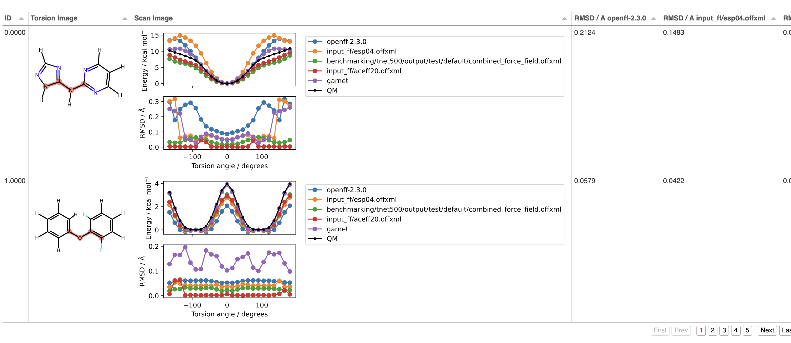
    </div>
    <figcaption><span class="step-n">1</span> <strong>Before</strong> — a static benchmark figure, one viewpoint, no interaction</figcaption>
  </figure>

  <figure class="collab-step">
    <div class="talk-graphic">
      <div class="talker left">
        <span class="avatar" aria-hidden="true"><svg viewBox="0 0 24 24" fill="currentColor"><path d="M12 12a5 5 0 100-10 5 5 0 000 10zm0 2c-5 0-9 2.5-9 6v2h18v-2c0-3.5-4-6-9-6z"/></svg></span>
        <span class="name">Dion</span>
      </div>
      <div class="bubbles">
        <span class="bubble r">“overlay energy, RMSD &amp; 3D per torsion”</span>
        <span class="bubble l">“sort by RMSE / mean error / JS-distance”</span>
        <span class="bubble r">“SMARTS search + 4-atom highlight”</span>
        <span class="bubble l">“let us export the subset worth a look”</span>
      </div>
      <div class="talker right">
        <span class="avatar" aria-hidden="true"><svg viewBox="0 0 24 24" fill="currentColor"><path d="M12 12a5 5 0 100-10 5 5 0 000 10zm0 2c-5 0-9 2.5-9 6v2h18v-2c0-3.5-4-6-9-6z"/></svg></span>
        <span class="name">Jen · OpenFF</span>
      </div>
    </div>
    <figcaption><span class="step-n">2</span> <strong>We talk it through</strong> — exactly what the plot must show, in detail</figcaption>
  </figure>

 </div>

  <figure class="collab-step collab-col-right">
    <div class="collab-shot embed">
      <div class="embed-frame">
        <iframe data-src="https://framejs.io/j/0be1df7579b8302884ff967b6de59b49122e98df8631b558c5a2545b06652780" title="Torsion Drive force-field explorer" allow="clipboard-read; clipboard-write"></iframe>
      </div>
    </div>
    <figcaption><span class="step-n">3</span> <strong>Transcript + data → Claude</strong> → a far richer, interactive tool</figcaption>
  </figure>

</div>

<p class="concl">The human conversation <em>becomes</em> the spec — Claude turns it into an advanced visualization in minutes.</p>

Note: This is the use case that surprises people most, and it's a real one. Jen
Clark's torsion-drive benchmark started life as a static figure — the panel on
the left. Jen and I then sat down and talked through, in detail, what the figure
actually needed to answer: overlay energy, RMSD and the 3D geometry per torsion,
rank every torsion by RMSE or JS-distance, SMARTS search with four-atom
highlighting, export the interesting subset. That conversation — the raw
transcript — plus the underlying data went straight into Claude. The design
intent was already fully specified by the discussion; no designer, no separate
spec doc. What came back is the live explorer on the right. The meeting *is* the
spec, and the agent turns it into the visualization.


---

## Example OpenFF: benchmarking torsion drives

<div class="two-col lean-left-xl">

<div>

A TorsionDrive scan turned into a side-by-side force-field comparison.

<div class="bullets-qr">
<div class="bullets">

- Overlay **energy / RMSD / 3D** for multiple force fields **per torsion**
- Sort by **RMSE, mean error, geometry RMSD, JS-distance** for a chosen FF
- **SMARTS search**, 4-atom torsion highlight, distance measuring
- **Profile playback** + **subset export** for the cases worth a closer look

</div>
</div>

<div class="scan">
  
</div>

<p class="cite">Created by <span class="who">Jen Clark and team</span>, OpenFF</p>

</div>

<div class="embed-frame scroll">
  <iframe data-src="https://framejs.io/j/0be1df7579b8302884ff967b6de59b49122e98df8631b558c5a2545b06652780" title="Torsion Drive force-field explorer" allow="clipboard-read; clipboard-write"></iframe>
</div>

</div>

Note: The companion view, at the torsion level. TorsionDrive scans are a core
OpenFF benchmark — you drive a dihedral and compare each force field's energy
profile against QM. This app compares multiple force fields per torsion,
overlays energy, RMSD, and the 3D geometry, and lets you rank every torsion by
RMSE, mean error, geometric RMSD, or JS-distance for whichever force field you
pick. There's SMARTS substructure search, full four-atom torsion highlighting,
distance measuring, profile playback, and you can export the subset of cases
worth a closer look. This is the difference between a static benchmark table and
a tool a force-field developer actually explores — and it's just a link.

---

## Example OpenFF: benchmarking MM vs QM <span class="muted">— Rosemary</span>

<div class="two-col lean-left-xl">

<div>

Built from a real force-field validation dataset, then shared as a link.

<div class="bullets-qr">
<div class="bullets">

- **MM-minus-QM** deviations for bonds, angles, torsions across **5 force
  fields**
- Per-parameter **violin / box / swarm**, periodicity-aware **QM-vs-MM scatter**
- **RMSD-aligned 3D overlay**, hover to see the **2D structure**

</div>
</div>
<div class="scan">
  
  <span class="scan-label"><strong>Scan to open</strong><br>the live explorer<br><code class="muted">framejs.io/j/f21362…</code></span>
</div>

<p class="cite">Created by <span class="who">Lily Wang</span>, OpenFF</p>

</div>

<div class="embed-frame scroll">
  <iframe data-src="https://framejs.io/j/f21362431d14fbdb2c117a0c2425d910e857a931ff9499e47ddd4a1148fcf3e8" title="Rosemary MM vs QM valence explorer" allow="clipboard-read; clipboard-write"></iframe>
</div>

</div>

Note: This is the exact kind of figure OpenFF force-field development depends
on. Rosemary is the next-generation OpenFF line; to trust a force field you have
to see where it disagrees with quantum mechanics. This explorer shows
MM-minus-QM deviations for every bond, angle, and torsion parameter across five
force fields — violin and swarm plots per parameter, a periodicity-aware
QM-vs-MM scatter, and an RMSD-aligned 3D overlay where you can hover any point
and see the 2D structure it came from. It started as a benchmarking dataset on
someone's machine; now it's a URL anyone on the project can open, and the QR
code goes straight to it.

---

## Example OpenFF: datasets across chemical space

<div class="two-col lean-left-xl">

<div>

A 2D UMAP of **3.67M molecules** across **7 OpenFF datasets** — QCArchive,
SPICE, GEOM, ANI2X, THEMol — live in the browser.

<div class="bullets-qr">
<div class="bullets">

- **Color and toggle** by dataset, data type, or overlap — see where training
  sets share chemistry
- **SMARTS search** highlights matches across all 3.67M; hover any point for its
  SMILES

</div>
</div>

<div class="scan">
  
</div>

<p class="cite">Created by <span class="who">Lily Wang</span>, OpenFF</p>

</div>

<div class="embed-frame scroll">
  <iframe data-src="https://framejs.io/j/b1ede1b0e0c94995020886df6b8f7ed76c0b8a0794ae614b2fafff57ba423def" title="Chemical-space dataset explorer" allow="clipboard-read; clipboard-write"></iframe>
</div>

</div>

Note: The last example zooms all the way out — the whole chemical space OpenFF
trains on. It's a 2D UMAP of every molecule across seven datasets — QCArchive
optimization and torsion-drive sets, SPICE, GEOM, ANI2X, and THEMol — about 3.67
million points, all rendered in the browser with WebGL2. You can color by
dataset, by data type, or by overlap to see exactly where these training sets
cover the same chemistry and where each one reaches into regions the others
miss. Toggle datasets or types on and off to compare coverage, run a SMARTS
substructure search that highlights matching molecules across all 3.67 million,
and hover any point to read its SMILES. A coverage map like this normally lives
in one researcher's notebook; here it's a link anyone can open and explore.

---

<!-- .slide: class="top-align" -->

## Goal: Notebook integration

- OpenFE/FF/etc objects automatically visualize themselves inside notebooks
- Visualization immediately **shareable**

<br/>

<div class="notebook">

<div class="nb-cell">
<div class="nb-prompt">In [1]:</div>
<div class="nb-body">

```bash
ligand_network
```

</div>
</div>

<div class="nb-cell frame">
<div class="nb-prompt">In [2]:</div>
<div class="nb-body">
  <iframe data-src="https://framejs.io/j/8c6a0119bddd831cf4d87d252d56144ceb33a3a133b78151de9cabe4481cb75e" title="OpenFE ligand network visualization" allow="clipboard-read; clipboard-write"></iframe>
</div>
</div>

</div>

Note: The notebook story closes the loop. `pip install metaframe-widget`, and
any framejs page becomes an interactive widget in JupyterLab, classic Notebook,
VS Code, or Colab. You can load it from a short URL or write the JS inline. Data
flows both ways: `set_inputs` pushes from Python into the widget, outputs come
back to Python, and `pipe_to` chains widgets into a pipeline. The visualization
state is preserved across re-runs — your slider position, your camera angle.

---


<!-- .slide: class="cli-slide top-align" -->

## Goal: CLI/terminal integration

- OpenFE/FF/etc objects automatically open visualization browser tab
- Visualization immediately **shareable**


```bash
openff view network.graphml
```

<div class="browser-frame">
  <div class="browser-bar">
    <div class="browser-dots">
      <span class="dot red"></span>
      <span class="dot yellow"></span>
      <span class="dot green"></span>
    </div>
    <div class="browser-address">framejs.io/j/8c6a0119…</div>
  </div>
  <div class="embed-frame">
    <iframe data-src="https://framejs.io/j/8c6a0119bddd831cf4d87d252d56144ceb33a3a133b78151de9cabe4481cb75e" height="720" title="OpenFE ligand network visualization" allow="clipboard-read; clipboard-write"></iframe>
  </div>
</div>


---

## Hands-on — your turn

<ol class="steps">
  <li>Install the skill: <code>curl -fsSL https://framejs.io/skill/install.sh | sh</code></li>
  <li>Open <strong>Claude Code</strong> in a folder that has a data file (<code>.csv</code>, <code>.json</code>, <code>.graphml</code>, a structure…)</li>
  <li>Prompt it: <em>“visualize ./mydata.csv as an interactive chart”</em></li>
  <li>Open the short URL it prints — tweak with follow-up prompts</li>
  <li>Drop the link into Notion, obsidian, LinkedIn, Slack or an <code>&lt;iframe&gt;</code> in your website</li>
</ol>

<p class="concl">Bring your own data. If you don't have one handy, try a PDB id or a CSV.</p>

Note: Now you do it. Install the skill, open Claude Code in a directory that has
a data file, and ask it to visualize that file. Open the link it gives you, then
iterate with follow-up prompts — "color by cluster," "add a slider," whatever.
Finally, take the short URL and embed it: either as a notebook widget or a plain
iframe. Bring your own data if you have it; otherwise a PDB id or any CSV works.
I'll come around to help.

---

## Advanced usage: iterate

Already have a visualization? Paste its URL into a Claude session and describe
what you want changed.

<p class="prompt">
  <span class="p">&gt;</span> framejs.io/j/8c6a0119… — make the nodes colour-coded by<br>
  &nbsp;&nbsp;perturbation type and add a legend<br>
  <span class="o">→ https://framejs.io/j/3f9a22…  (opened)</span>
</p>

- The agent fetches the existing code from the URL and modifies it
- Iterating a **snapshot** mints a new immutable URL — the old one stays intact;
  iterating a **durable Frame** updates in place and appends a version
- Own the frame already? *Copy frame for AI session* hands the agent a token so
  it can keep editing **your** frame
- Chain as many follow-ups as you like: layout, colours, filters, annotations

<p class="concl">The URL is the save point — you iterate just by prompting.</p>

Note: The short URL is a read-only snapshot. Paste it into Claude, describe a
change — "make nodes larger," "add a time slider," "export as SVG button" — and
the agent fetches the source, edits it, and mints a new link. The original
is unchanged. You build up a chain of immutable snapshots with no manual
version management.


---

<!-- .slide: class="title-slide" -->


<span class="kicker">Thank you</span>

# Build it. Share the link. <!-- .element: class="accent" -->

- **framejs.io** — open the editor
- **framejs.io/docs** — guide, examples, integrations
- **Skill:** `curl -fsSL https://framejs.io/skill/install.sh | sh`

<p class="byline">Dion Whitehead · Open Molecular Software Foundation</p>

Note: That's framejs: a primitive for interactive scientific visualizations that
live in a URL, built by describing them, and embeddable anywhere. The docs have
deeper guides on the JavaScript API, notebooks, and short URLs. Install the
skill, point it at your data, and share the link. Thanks — let's build.


---

## Why this fits the OMSF ecosystem

<!-- - **OpenMM**, **OpenFF**, **OpenFE**, **OpenADMET** emit
rich, multi-dimensional data: -->
- **Open:** OMSF **software** is open and reusable, so **figures that explain it** should
  be too.
- **Share:** The plots, figures, and visualizations for every project are in locked in
  notebooks, or flattened to **static PNGs** in publications or docs, or if interactive they are not easily usable by others
- **Re-use:** framejs turns a visualization into a **reusable component**: a URL _anyone_
  can open, embed, fork, and re-point at new data, use interchangeably between terminal, web, and notebooks (latter is aspirational)

<p class="concl">Open, reproducible <em>science</em> needs open, reproducible <em>visualization</em>.</p>

Note: Before more mechanics, why this belongs at OMSF specifically. OMSF is the
home of the open molecular simulation stack — OpenMM for dynamics, OpenFF for
force fields, OpenFE for free energy. Every one of these produces dense,
multi-dimensional data that only makes sense when you can see it and poke at it.
But visualization is the part nobody owns: each project rebuilds the same plots,
the good interactive version lives in one person's notebook, and what ships in
the docs is a flat PNG. framejs makes the visualization itself a reusable,
shareable artifact — the same open, reproducible standard we hold the code to.
The next few slides show that on real OMSF-flavored data.

